# medical_qa

A project about medical questioning and answering

# 先用GPT-2 pretrain，将问答建模成生成式问题

即question+answer，从左往右进行生成

### 问题

模型不知道哪部分是问句，哪部分是回答

参考`LaMDA`的做法

此处建模成

`<QBOS>` question `<QEOS>` `<ABOS>` answer `<AEOS>`

样例数据：

    <QBOS>小儿肥胖超重该怎样医治？<QEOS><ABOS>孩子一旦患上肥胖症家长要先通过运动和饮食来改变孩子的情况，要让孩子做一些他这个年龄段能做的运动，如游泳，慢跑等，要给孩子多吃一些像苹果，猕猴桃，胡萝卜等食物，禁止孩子吃高热量，高脂肪的食物，像蛋糕，干果，曲奇饼干等，严格的控制孩子的饮食，不要让他暴饮暴食，多运动对改变孩子肥胖都是有好处的，在治疗小儿肥胖期间如果情况严重，建议家长先带孩子去医院检查一下孩子肥胖症的原因在针对性的治疗。<AEOS>
    <QBOS>小儿肥胖能吃该如何治疗？<QEOS><ABOS>当孩子患上肥胖症的时候家长可以增加孩子的运动量和控制他的饮食来改变症状，像游泳，爬坡这类游泳运动对肥胖的症状都很好的效果，像冬瓜，西红柿这样高纤维的蔬菜要多吃一些，孩子不可以吃像蛋糕，夏威夷果这些高热量的食物，而且不要让孩子总是吃完就躺在床上不动，家长在治疗小儿肥胖期间如果孩子情况严重就要及时去医院在医生的指导下给孩子治疗。<AEOS>
    <QBOS>小儿肥胖超重该如何治疗？<QEOS><ABOS>孩子出现肥胖症的情况。家长要通过孩子运功和健康的饮食来缓解他的症状，可以先让他做一些有氧运动，比如慢跑，爬坡，游泳等，并且饮食上孩子多吃黄瓜，胡萝卜，菠菜等，禁止孩子吃一些油炸食品和干果类食物，这些都是干热量高脂肪的食物，而且不要让孩子总是吃完就躺在床上不动，家长在治疗小儿肥胖期间如果孩子情况严重就要及时去医院在医生的指导下给孩子治疗。<AEOS>
    <QBOS>小儿肥胖能吃该如何医治？<QEOS><ABOS>当孩子患上肥胖症的时候家长可以增加孩子的运动量和控制他的饮食来改变症状，家长要监督孩子做一些有氧运动像慢跑，游泳等，要给孩子多吃一些像苹果，猕猴桃，胡萝卜等食物，一定要禁止孩子吃蛋糕，板栗这些高热量的食物，生活中不要让孩子在床上吃零食或者吃完就躺着这些不好的习惯也会让脂肪堆积，肥胖症治疗期间家长要根据孩子的情况进行合理的治疗，如果病情严重的话一定要去医院查明原因针对治疗。<AEOS>

tokenizer-ID映射关系

    <QBOS>-1
    <QEOS>-2
    <ABOS>-3
    <AEOS>-4

实际例子数据

    '<QBOS>癫痫病人请假吗？<QEOS><ABOS>病情分析：你好！你这个可以去医院看看指导意见：可以做一些检查，如果是癫痫，医生应该会给你开的。，癫痫病患者在及时治疗之外，患者在生活中还需要注意要保持良好的心情，好的心情对疾病的恢复很有帮助，希望上述的答案可以帮助到你，谢谢！<AEOS>'
    [101, 1, 4626, 4587, 4567, 782, 6435, 969, 1408, 8043, 2, 3, 4567, 2658, 1146, 3358, 8038, 872, 1962, 8013, 872, 6821, 702, 1377, 809, 1343, 1278, 7368, 4692, 4692, 2900, 2193, 2692, 6224, 8038, 1377, 809, 976, 671, 763, 3466, 3389, 8024, 1963, 3362, 3221, 4626, 4587, 8024, 1278, 4495, 2418, 6421, 833, 5314, 872, 2458, 4638, 511, 8024, 4626, 4587, 4567, 2642, 5442, 1762, 1350, 3198, 3780, 4545, 722, 1912, 8024, 2642, 5442, 1762, 4495, 3833, 704, 6820, 7444, 6206, 3800, 2692, 6206, 924, 2898, 5679, 1962, 4638, 2552, 2658, 8024, 1962, 4638, 2552, 2658, 2190, 4565, 4567, 4638, 2612, 1908, 2523, 3300, 2376, 1221, 8024, 2361, 3307, 677, 6835, 4638, 5031, 3428, 1377, 809, 2376, 1221, 1168, 872, 8024, 6468, 6468, 8013, 4, 102]
    ['<QBOS>', '癫', '痫', '病', '人', '请', '假', '吗', '？', '<QEOS>', '<ABOS>', '病', '情', '分', '析', '：', '你', '好', '！', '你', '这', '个', '可', '以', '去', '医', '院', '看', '看', '指', '导', '意', '见', '：', '可', '以', '做', '一', '些', '检', '查', '，', '如', '果', '是', '癫', '痫', '，', '医', '生', '应', '该', '会', '给', '你', '开', '的', '。', '，', '癫', '痫', '病', '患', '者', '在', '及', '时', '治', '疗', '之', '外', '，', '患', '者', '在', '生', '活', '中', '还', '需', '要', '注', '意', '要', '保', '持', '良', '好', '的', '心', '情', '，', '好', '的', '心', '情', '对', '疾', '病', '的', '恢', '复', '很', '有', '帮', '助', '，', '希', '望', '上', '述', '的', '答', '案', '可', '以', '帮', '助', '到', '你', '，', '谢', '谢', '！', '<AEOS>']

### 训练参数脚本

    python run_clm.py \
      --model_name_or_path gpt2-chinese-cluecorpussmall \
      --train_file all.txt \
      --per_device_train_batch_size 6 \
      --do_train \
      --save_step=5000 \
      --num_train_epochs 4 \
      --output_dir ./medical-clm

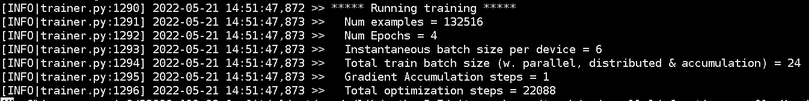

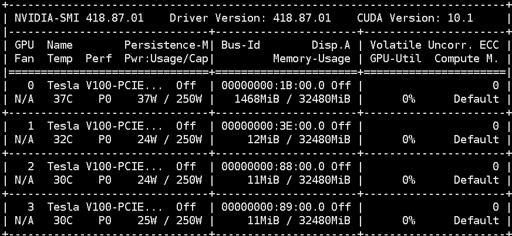

训练用时`21小时12分钟`

### 训练好模型以后进行推理：

GPT-output1

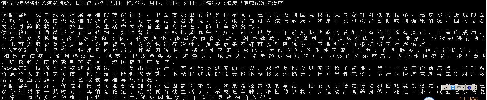

这个结果还比较正常

GPT-output2

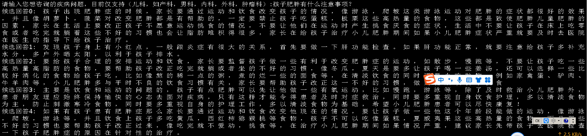

这个结果候选回答1不符合主题

GPT-output3

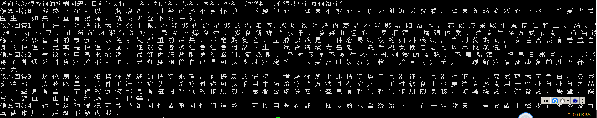

这个问题在文本训练的过程中没有涉及相关领域的训练数据，导致回答不好

为了保证相关性，可以对问句中的`疾病`、`症状`建立术语表后进行分词，回答中至少出现相关疾病、症状才算相关的回答。

存在一些问题：

    1.知识修改的代价--疾病治疗情况发生了改变
    2.逻辑修改的代价--新的疾病进来
    3.模型本身输出的不可控性--模型答非所问
    4.推理速度比较慢

### 一些改进和想法

基于faiss做FAQ

Faiss的全称是Facebook AI Similarity Search。 它是一个开源库，针对高维空间中的海量数据，提供了高效且可靠的检索方法。

将原csv文件中的question，经过sbert-base-chinese-nli，encode成向量，然后将向量喂入到faiss库当中

每当新进来一个question的时候，将这个question也encode成向量，然后基于faiss进行向量检索

选择最相似的question的答案来作为目标question的答案

基本用法：

    index = faiss.IndexFlatL2(d)/faiss.IndexFlatIP--d代表向量的维度
    index.add()--numpy格式，float32
    index.search()--向量，找k个

faiss.IndexFlatL2(d):

    numpy.sqrt(numpy.sum(numpy.square(searched - query))),平方

faiss.IndexFlatIP(d):

    np.dot(query.T, searched)

基本方法是暴力搜索，即遍历每一个向量进行计算的，如果index里面的向量过于多了，就会有问题

faiss.IndexIVFFlat：构建索引

    quantizer = faiss.IndexFlatL2(d)  # 量化器
    index = faiss.IndexIVFFlat(quantizer, d, nlist--聚类中心个数, faiss.METRIC_L2)
    index.train(vectors) # 要对这堆向量算出聚类中心
    index.add(vectors)
    index.nprobe = 5 # 修改查找的聚类中心，默认的时候是先去找nprobe个聚类中心，然后再比较这里面的所有
    注意nprobe和nlist两个数值要匹配使用，一般是成比例增大

但是768维的向量，总体来说还是比较大的，而在faiss当中有压缩算法，可以对向量进行压缩

    quantizer = faiss.IndexFlatL2(d)
    index = faiss.IndexIVFPQ(quantizer,d,nlist--聚类中心个数,m--切割成m份，8)   #注意最后一个参数nbits_per_idx要小于等于8
    index.train(xb)
    index.add(xb)
    index.nprobe = 3 # 搜索的聚类个数

三种index索引情况：

    search_one_query("孩童中耳炎流黄水要如何医治", normal_index, 2)
    句子生成向量时间， 1.0599839687347412
    索引向量时间， 0.0010004043579101562
    Out[4]: (array([[0.     , 7.86909]], dtype=float32), array([[ 28, 755]], dtype=int64))
    search_one_query("孩童中耳炎流黄水要如何医治", center_index, 2)
    句子生成向量时间， 1.0576732158660889
    索引向量时间， 0.0009987354278564453
    Out[5]: (array([[0.     , 7.86909]], dtype=float32), array([[ 28, 755]], dtype=int64))
    search_one_query("孩童中耳炎流黄水要如何医治", compression_index, 2)
    句子生成向量时间， 1.0959687232971191
    索引向量时间， 0.0
    Out[6]: 
    (array([[5.6189117, 9.614075 ]], dtype=float32),
     array([[ 28, 755]], dtype=int64))

整体来说，对于比较大的n，IndexIVFFlat肯定优于IndexFlatL2

其次随着n进一步增大，需要对原始向量进行压缩，从而节省存储空间

下来以后好好理解一下这两个blog：

https://blog.csdn.net/rangfei/article/details/108177652

https://blog.csdn.net/qq_33283652/article/details/116976900

#### 整体来说

FAQ本身的缺点：

回答只能限定在原本的这些问题-答案里面，扩展的时候就得加问题-答案；并且随之修改索引（倒排索引，faiss索引）等

简单一点的索引也可以通过构建分词后，以词作为倒排的倒排索引

然后基于tf-idf/BM25算法/编辑距离相似度/基本的向量距离，余弦/基于s-bert做语义相似度

从左到右，基本的一个发展还是，前面的是关键词匹配，语义信息不需要两者完全一致，较为模糊的时候，关键词匹配即可

当比较的两者需要比较严格，一些否定，比如说能吃什么和不能吃什么，用深度学习会更好

faiss作为索引的优点是可以直接使用聚类，压缩算法，同时也能保留语义信息

#### 构建过程

首先将所有的question去重以后，经过`bert`变成`1*768`维的向量，选取的bert模型为`sbert-base-chinese-nli`

将向量送入到faiss的IndexIVFPQ方法进行索引构建

这个方法的好处是

其一是进行聚类，避免了在搜索的过程中进行全部向量的暴力搜索和比较

其二是进行了乘积向量变换，对向量进行了压缩，避免了之后可能扩展系统768维向量都加载到内存中造成cuda溢出

参数情况： `256-聚类中心` `划分8个子空间` `256-子空间聚类中心-8bits`

1.索引构建时间和加载answer所用时间.png

2.单条查询所需时间

整体比GPT-2要快很多

vs GPT-2生成单个问题5条回答所用的时间

大致时间差8~9倍

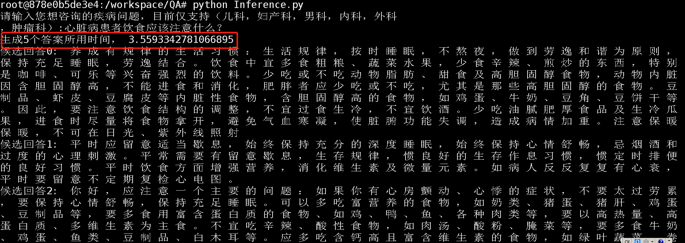

3.查询质量

Faiss-output1

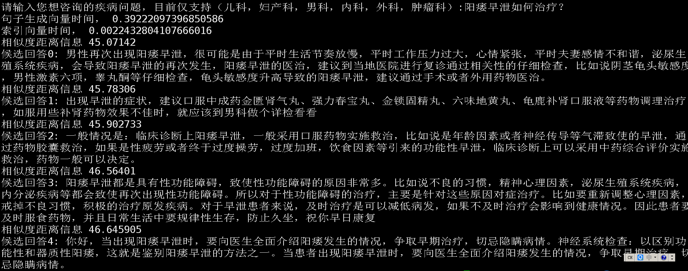

Faiss-output2

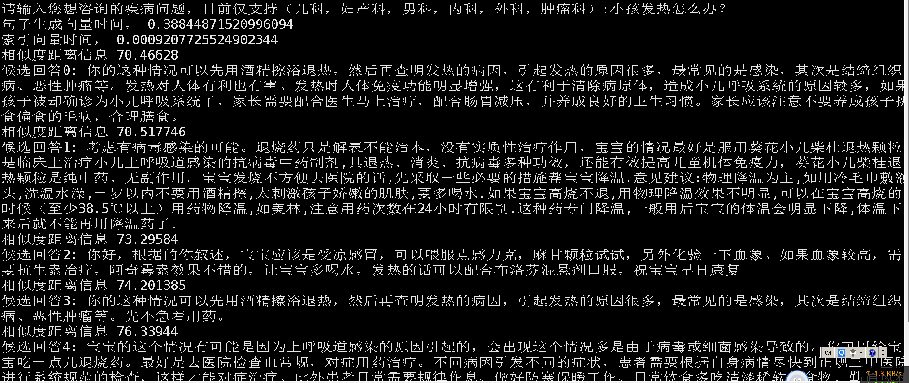

Faiss-output3

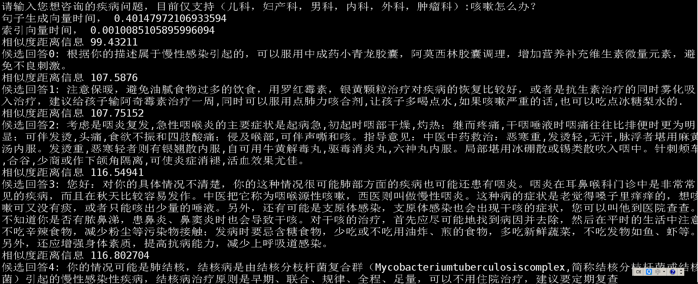

Faiss-output4

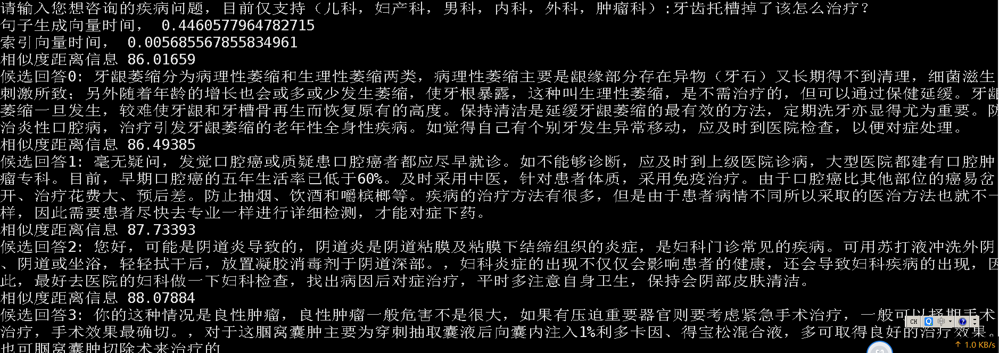

相比于GPT-2，输出都是严格按照预定义好的格式，不会不可控

对于未定义的问题，由于问句太短，相似度比较容易相似，例如牙齿托槽掉了应该如何治疗和宝宝发热了应该如何治疗都是比较相似的

如果预定义的问题里面没有牙齿、托槽相关的question，就会导致发烧也可能会被匹配出来，而且相似度较高

经过一定的试验和观察，distance如果大于150的话，检索出来的结果基本不太可信

将其设置为unanswerable，或者提示提问不明显。

faiss-unanswerable1

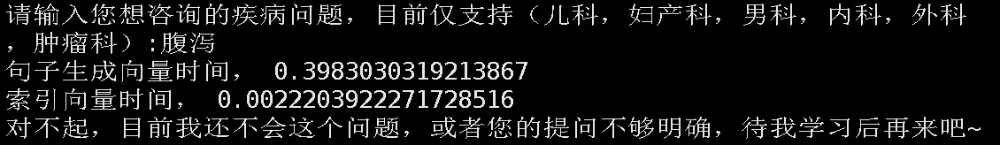

query->question->answer

其实本质上和搜索没有什么区别，把query看作是一条查询

question相当于是各个`文章/新闻/网页`的`标题`

基于标题进行内容检索的过程

那么进一步来考虑的话，不一定需要仅仅只对标题进行检索，文章的内容也是很重要的，考虑encode answer部分，构建成向量，由query直接查询相似答案

### 构建answer的向量表示

基于传统的搜索算法：

BM25

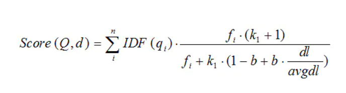

首先将所有answer去重后进行jieba分词，过滤掉部分停用词，保存到answer_cut.csv

基于此再构建一个词的倒排索引，包含某个词的文档有哪些，记录下其id

DPR

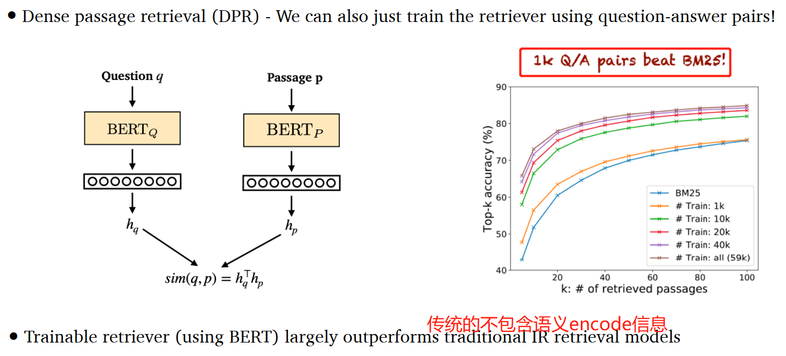

采用前面类似的方法对问题进行向量化，然后输入question，查找最相似的answer

search_answer_directly

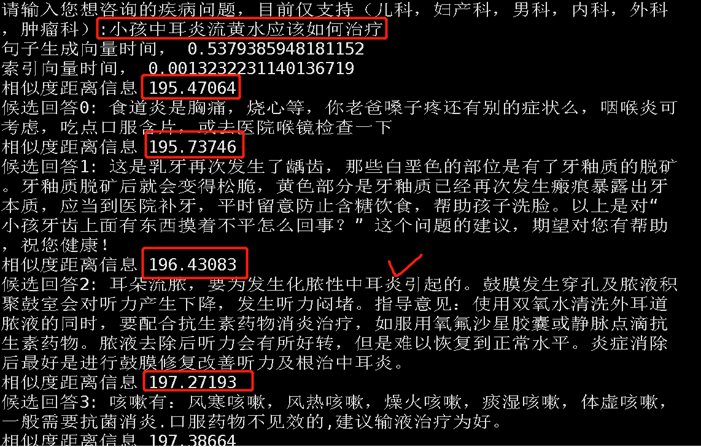

发现结果并不好

问题一般在10个字以内，答案在几十个字~几百字不等

在一般的`sbert-base-chinese-nli`模型下（encode两个句子表达的意思是不是同一个），这样本身question和answer就是不相似的

因此没有办法用这样的方法进行encode和search

即便是采用IndexFlatIP计算内积/余弦相似度的办法相似度也不高

    search_one_query("孩童中耳炎流黄水要如何医治", normal_index, 2)
    句子生成向量时间， 1.0909523963928223
    索引向量时间， 0.0
    Out[3]: 
    (array([[283.7532 , 282.30878]], dtype=float32),
     array([[55, 91]], dtype=int64))

如果还是采用向量相似的方法，正常来说训练一个模型encode question和answer到相同的向量表示会比较困难，对模型来说也可能出现confuse的情况（长短文本不一致）

一般还是考虑query/question用一个encoder，answer/reference text部分用另一个encoder

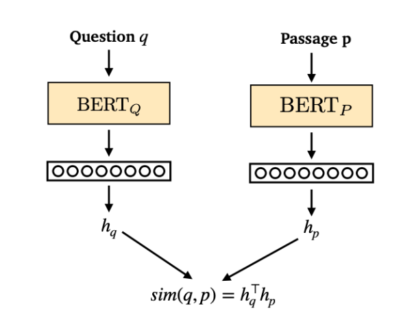

### 训练一个能够判断qnli的模型，用于判断当前找到的answer是否成立

由于找最相似的question/answer 都不可避免出现答非所问的情况，考虑qnli任务

在huggingface上看了一下，没有chinese qnli，在github上找到一个开源数据集，自行训练

https://github.com/alibaba-research/ChineseBLUE

训练参数：

    python run_glue.py \
      --model_name_or_path ../pretrain_model/bert-base-multilingual-cased \
      --train_file ./data/QNLI_train_file.json  \
      --validation_file ./data/QNLI_eval_file.json \
      --do_train \
      --do_eval \
      --max_seq_length 512 \
      --per_device_train_batch_size 6 \
      --learning_rate 3e-5 \
      --num_train_epochs 3 \
      --output_dir ./qnli \

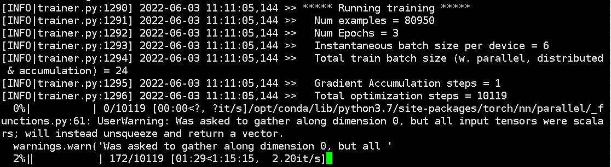

训练完成后可以用于精排阶段，验证文本是否是答案。

测试一些基本的对话

test_qnli1

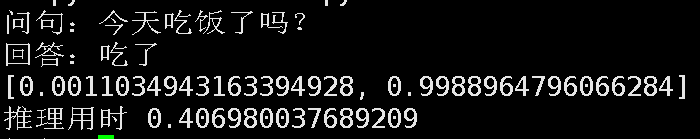

test_qnli2

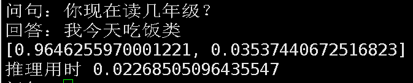

test_qnli3

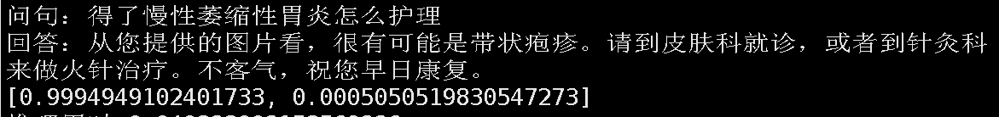

test_qnli4

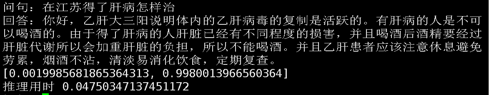

之前的方法利用相似度距离信息进行粗略地筛选

当distance小于150时进行answer输出，但是这个实际上是不合理的，相似度低说明几乎接近question库里的问题，

而有一些能够对应上的question相似度确是190多，表意一致，但是相似度较大

同时，原本qa对也可能出现答非所问的情况，相似度高并不一定就是好的回答

由于qnli任务选用小bert模型，inference的时候耗时较少，考虑由qnli推断找到的answer是否要进行输出:

输出情况：

faiss-output_with_qnli1

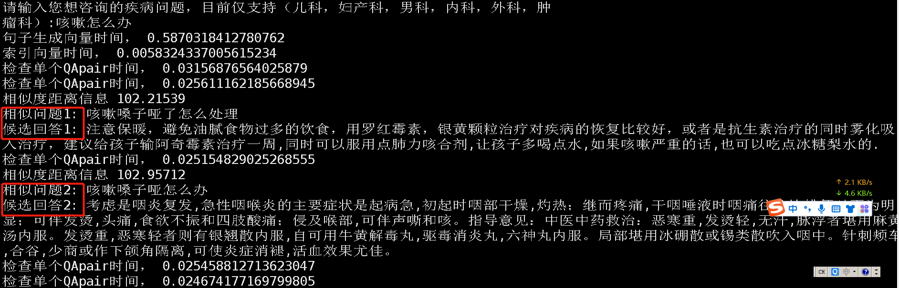

faiss-output_with_qnli2

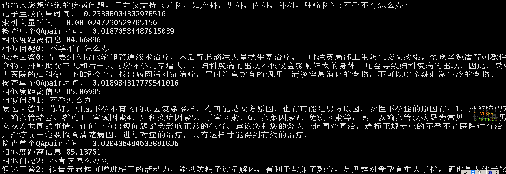

### 把整个项目打包成api+docker

服务启动

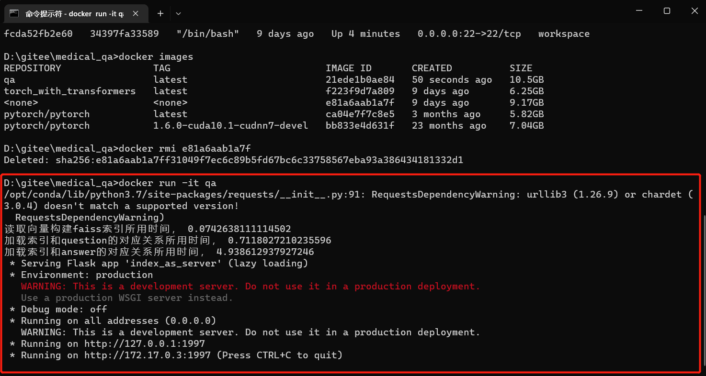

服务访问

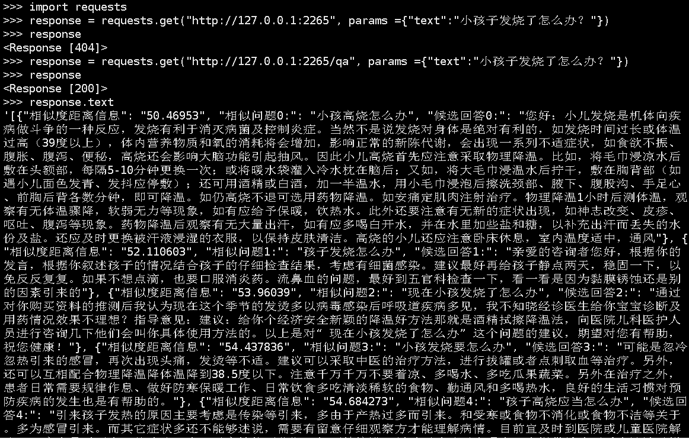

docker打包

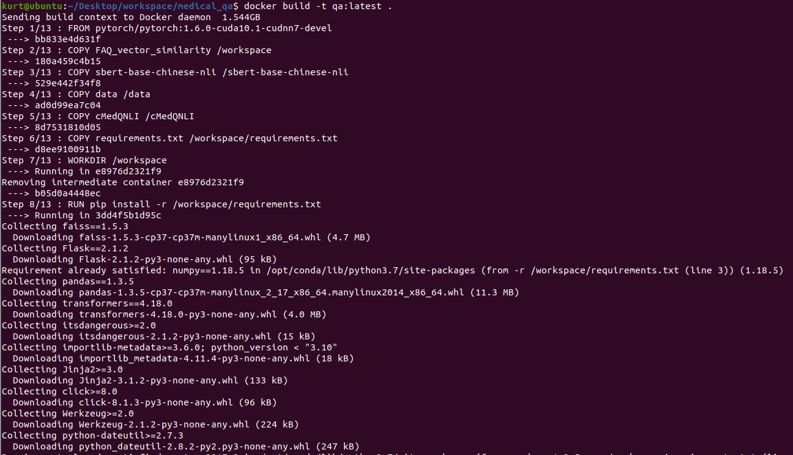

