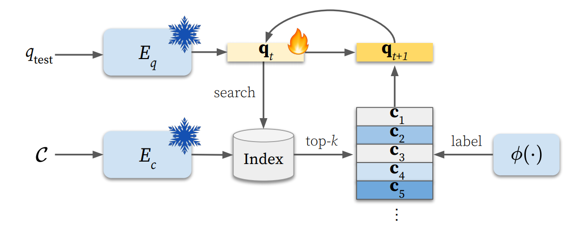
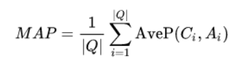
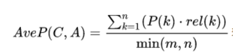
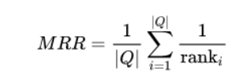
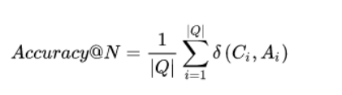
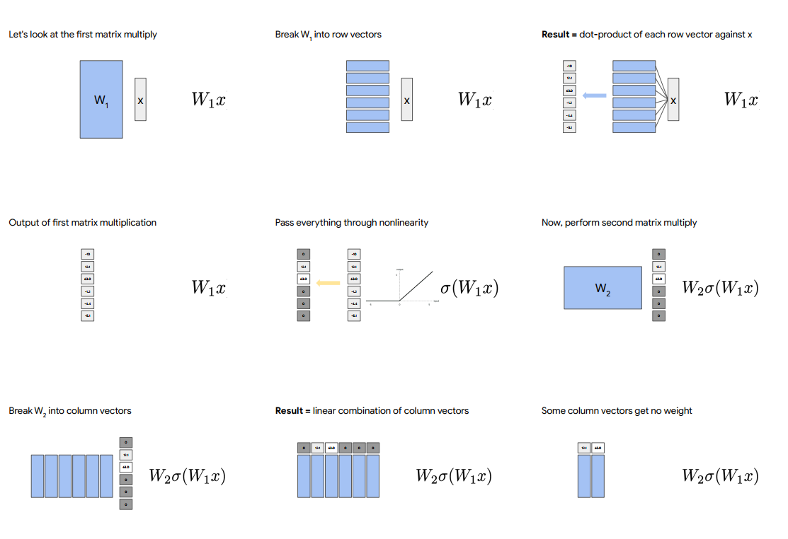
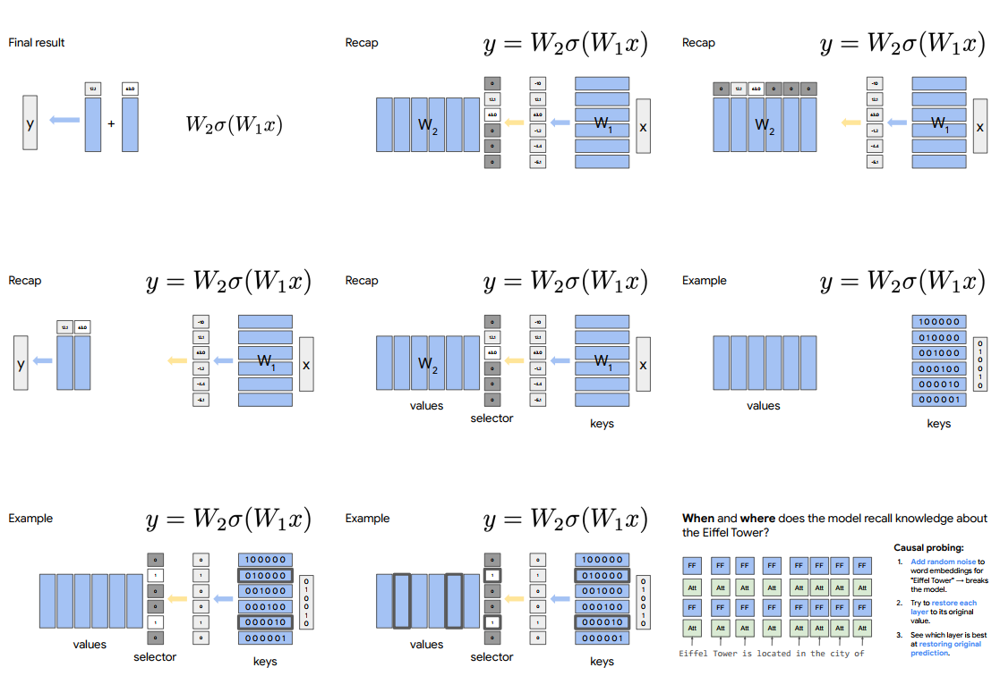
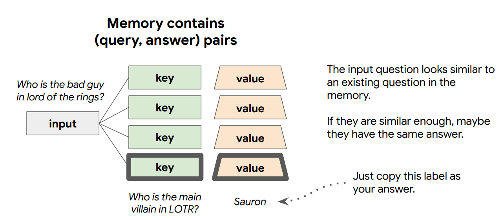
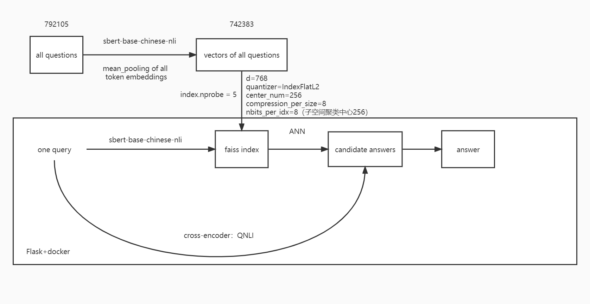
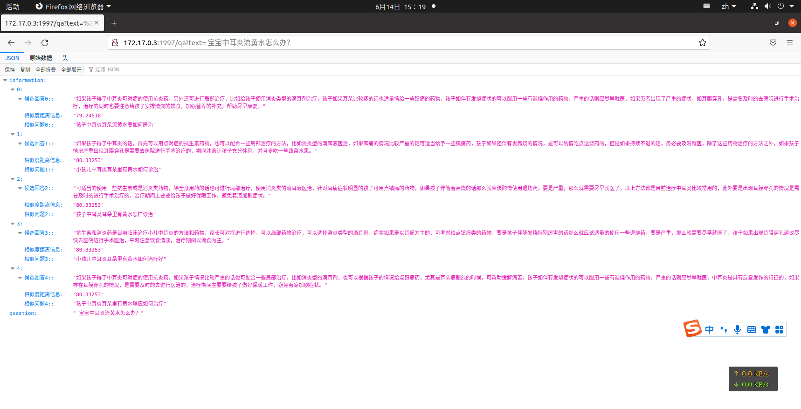

# medical_qa

A project about medical question and answering

# 近期论文阅读

近期阅读的部分论文和心得：

DrQA：[Reading Wikipedia to Answer Open-Domain Questions](https://arxiv.org/abs/1704.00051)

ORQA：[Latent Retrieval for Weakly Supervised Open Domain Question Answering](https://arxiv.org/abs/1906.00300)

DPR：[Dense Passage Retrieval for Open-Domain Question Answering](https://arxiv.org/abs/2004.04906)

Phrase encoder：[Learning Dense Representations of Phrases at Scale](https://arxiv.org/abs/2012.12624)

GAR：[Generation-augmented retrieval for open-domain question answering](https://arxiv.org/abs/2009.08553)

RocketQA：[RocketQA An Optimized Training Approach to Dense Passage Retrieval for Open-Domain Question Answering](https://arxiv.org/abs/2010.08191)

20220525TQR（Test-time Query Refinement）：[Refining Query Representations for Dense Retrieval at Test Time](https://arxiv.org/abs/2205.12680)

大致梳理一下open-domain question and answering的时间线和发展关系

DrQA是比较早期的问答系统，采用的retriever和reader都是比较原始的方法，retriever主要是一些TF-IDF以及BM25这样的sparse
embedding；而reader部分当时主流的双向LSTM+attention注意力机制，以之为代表的是[BiDAF](https://arxiv.org/abs/1611.01603)

ORQA主要是针对早期的retriever都是基于sparse embedding，当出现关键词没有覆盖的情况时，就无法进行匹配，其设计了一个ICT反向完型填空任务，原本谷歌的BERT采用的是对句子进行挖空，填写[Mask]
而ORQA从段落中挖出一个句子的空，预测该句子和上下文、以及负采样其他上下文；将句子视作伪的question，形成一个无监督的大规模预训练；90%是不涉及原词，10%涉及到原词

DPR直接对前面两项工作进行重构，这种挖空出来的伪question上下游任务并不一致，提出基于现在已经较为成熟的pretrain model进行dual-encoder和in-batch negative

Learning Dense Representations of Phrases at Scale

    紧承DPR往后做的研究。既然可以用向量搜索的形式，为什么一定还需要reader（IR的累计错误+reader过于慢），是否可以直接搜索答案的向量。
    对于短语来说取的是spanbert中短语开始和结束位置的向量表示；对于问题来说，为了和短语同维度，选择两个bert取两个cls。
    
    数据增强+知识蒸馏：一般来说一个文档只标注了一个问题，想要学习出句子级别的表示不太够；抽取出全部的实体，然后实体+文档->经过一个T5 generative model，生成提问。
    反过来，用一个好的spanbert mrc模型，判断生成的question+文档->answer是否高可信，高可信的加入到训练当中。--老师教学生的方法，数据增强。
    
    pre-batch，记录下单卡最近几轮计算时的向量，作为负样本，然后将这些负样本一起放到loss里面的分母里去。--本质上还是增大负样本数量，理论上只有是负样本模拟真实场景应该是尽可能多。

    query-side fine-tune：固定下phrase encode部分，然后单独对query向量&查询出来的phrase top k，+-进行一遍fine-tune。--便于迁移领域，缩小预训练和使用的差异。
    最后这个东西构建起来以后，基本就像一个知识图谱了

整体这个Learning Dense Representations of Phrases at Scale的工作和后面RocketQA很像，甚至RocketQA的思想和这个基本一致。pre-batch vs
in-batch、cross-encoder的数据增强和知识蒸馏。

GAR主要是更加模拟人的思考过程；当一个人收到一个问题的时候，心里会先想起一些答案，以及关于答案的印象；如果是开卷情况，再按照自己的印象进行查找
q-->generate{answer、content、title},这些扩展出来的信息，能够自然地蕴含意图并涉及到的更多信息，然后再放到一个轻量的retriever上进行检索

RocketQA主要是基于DPR的工作在往下进行展开

通过分布式的多GPU，提出cross batch negative来优化in-batch negative，模拟真实场景中存在大量负样本选一个正样本的情况（和pre-batch，基本思想一样）

现在contrastive learning的范式，需要拉近正样本，拉远负样本，而数据集通过很随机的采样方式，会导致负样本是伪负样本；
目前的训练集相对于真实的场景，训练的数据还是不够；

针对正负样本的问题(正样本不足&负样本为假），用一个效率比较低，但是效果比较好的cross-encoder结构来当teacher，然后帮助dual-encoder student进行学习

TQA：主要还是承接DPR还有Phrase encoder这两个方法往下推进研究。在传统的DPR训练完成以后，得到dual-encoder结构的编码器。

dpr，QA+和QA-；Phrase encoder在QA+和QA-以后，跟了一个query-side fine-tune；从前一步到后一步可以看到，预训练和使用之间的差距进一步缩小了，其带来的结果为in-domain的效果变强，但是同时out-of-domain被削弱，甚至还不如稀疏表示的情况

那么如何解决ood的情况：

对于一个未训练到的新领域，单条query->top_100 context；

使用一个现成的cross-encoder作为teacher，去找100里面哪些属于正样本，哪些属于负样本，然后做query-side fine-tune；

特别地定义了一个蒸馏方法，KL loss来做teacher and student process

# update：_2022/6/29_

基于面试反馈，补充关于整个系统evaluation的一点想法

QA系统的一些基本评价指标：

MAP：

针对每个问题，p表示包含正确答案的个数，rel表示的是当前是否是正确答案。m和n分别代表库里包含的正确答案数和top_k检索个数n

例如某个问题是3个正确答案，某次检索中排名为1,3,5

理解为检索top1的话，有1个正确答案；检索top3会有两个正确答案；检索top5会有三个正确答案

分子为1/1+2/3+3/5

分母为min(3,5)

MRR：

针对每个问题，其第一个正确答案出现的位置rank；第一个正确答案出现的位置越靠前，得分就越高

Accuracy@N

针对每个问题，生成的N个问题里面，是正确的就记为1，是错误的就记为0，然后求平均

## Evaluation方案选择

从现有数据出发，只有QA pair的数据，比较符合的情况是MRR指标

考虑随机选取一定比率的QA pair出来，输入Q，检索top5，得到5个答案，然后看标准答案在5个答案的什么rank

如果没有被检索出来，相当于top5没有答案，score置为0

[request日志信息](evaluation/README.md)

经过计算，MRR=0.9479166666666665；几乎是将原本的q'-q'-a召回到了第一个位置

但是相对来说，问答的评估是一个比较主观的东西，更多是由测试者主观进行打分，最后综合求平均

# 生成式对话问答模型

基于[gpt2-chinese-cluecorpussmall](https://huggingface.co/uer/gpt2-chinese-cluecorpussmall)，将问答和对话建模成生成式问题

即question+answer，从左往右进行生成

### 训练方法和过程

模型不知道哪部分是问句，哪部分是回答

参考[LaMDA: Language Models for Dialog Applications](https://arxiv.org/pdf/2201.08239.pdf)的做法

此处建模成

`<QBOS>` question `<QEOS>` `<ABOS>` answer `<AEOS>`

后续也可以按照这些special token扩展多轮问答和对话的训练

训练样例数据：

    <QBOS>小儿肥胖超重该怎样医治？<QEOS><ABOS>孩子一旦患上肥胖症家长要先通过运动和饮食来改变孩子的情况，要让孩子做一些他这个年龄段能做的运动，如游泳，慢跑等，要给孩子多吃一些像苹果，猕猴桃，胡萝卜等食物，禁止孩子吃高热量，高脂肪的食物，像蛋糕，干果，曲奇饼干等，严格的控制孩子的饮食，不要让他暴饮暴食，多运动对改变孩子肥胖都是有好处的，在治疗小儿肥胖期间如果情况严重，建议家长先带孩子去医院检查一下孩子肥胖症的原因在针对性的治疗。<AEOS>
    <QBOS>小儿肥胖能吃该如何治疗？<QEOS><ABOS>当孩子患上肥胖症的时候家长可以增加孩子的运动量和控制他的饮食来改变症状，像游泳，爬坡这类游泳运动对肥胖的症状都很好的效果，像冬瓜，西红柿这样高纤维的蔬菜要多吃一些，孩子不可以吃像蛋糕，夏威夷果这些高热量的食物，而且不要让孩子总是吃完就躺在床上不动，家长在治疗小儿肥胖期间如果孩子情况严重就要及时去医院在医生的指导下给孩子治疗。<AEOS>
    <QBOS>小儿肥胖超重该如何治疗？<QEOS><ABOS>孩子出现肥胖症的情况。家长要通过孩子运功和健康的饮食来缓解他的症状，可以先让他做一些有氧运动，比如慢跑，爬坡，游泳等，并且饮食上孩子多吃黄瓜，胡萝卜，菠菜等，禁止孩子吃一些油炸食品和干果类食物，这些都是干热量高脂肪的食物，而且不要让孩子总是吃完就躺在床上不动，家长在治疗小儿肥胖期间如果孩子情况严重就要及时去医院在医生的指导下给孩子治疗。<AEOS>
    <QBOS>小儿肥胖能吃该如何医治？<QEOS><ABOS>当孩子患上肥胖症的时候家长可以增加孩子的运动量和控制他的饮食来改变症状，家长要监督孩子做一些有氧运动像慢跑，游泳等，要给孩子多吃一些像苹果，猕猴桃，胡萝卜等食物，一定要禁止孩子吃蛋糕，板栗这些高热量的食物，生活中不要让孩子在床上吃零食或者吃完就躺着这些不好的习惯也会让脂肪堆积，肥胖症治疗期间家长要根据孩子的情况进行合理的治疗，如果病情严重的话一定要去医院查明原因针对治疗。<AEOS>

tokenizer-ID映射关系

    <QBOS>-1
    <QEOS>-2
    <ABOS>-3
    <AEOS>-4

tokenizer实例

    '<QBOS>癫痫病人请假吗？<QEOS><ABOS>病情分析：你好！你这个可以去医院看看指导意见：可以做一些检查，如果是癫痫，医生应该会给你开的。，癫痫病患者在及时治疗之外，患者在生活中还需要注意要保持良好的心情，好的心情对疾病的恢复很有帮助，希望上述的答案可以帮助到你，谢谢！<AEOS>'
    [101, 1, 4626, 4587, 4567, 782, 6435, 969, 1408, 8043, 2, 3, 4567, 2658, 1146, 3358, 8038, 872, 1962, 8013, 872, 6821, 702, 1377, 809, 1343, 1278, 7368, 4692, 4692, 2900, 2193, 2692, 6224, 8038, 1377, 809, 976, 671, 763, 3466, 3389, 8024, 1963, 3362, 3221, 4626, 4587, 8024, 1278, 4495, 2418, 6421, 833, 5314, 872, 2458, 4638, 511, 8024, 4626, 4587, 4567, 2642, 5442, 1762, 1350, 3198, 3780, 4545, 722, 1912, 8024, 2642, 5442, 1762, 4495, 3833, 704, 6820, 7444, 6206, 3800, 2692, 6206, 924, 2898, 5679, 1962, 4638, 2552, 2658, 8024, 1962, 4638, 2552, 2658, 2190, 4565, 4567, 4638, 2612, 1908, 2523, 3300, 2376, 1221, 8024, 2361, 3307, 677, 6835, 4638, 5031, 3428, 1377, 809, 2376, 1221, 1168, 872, 8024, 6468, 6468, 8013, 4, 102]
    ['<QBOS>', '癫', '痫', '病', '人', '请', '假', '吗', '？', '<QEOS>', '<ABOS>', '病', '情', '分', '析', '：', '你', '好', '！', '你', '这', '个', '可', '以', '去', '医', '院', '看', '看', '指', '导', '意', '见', '：', '可', '以', '做', '一', '些', '检', '查', '，', '如', '果', '是', '癫', '痫', '，', '医', '生', '应', '该', '会', '给', '你', '开', '的', '。', '，', '癫', '痫', '病', '患', '者', '在', '及', '时', '治', '疗', '之', '外', '，', '患', '者', '在', '生', '活', '中', '还', '需', '要', '注', '意', '要', '保', '持', '良', '好', '的', '心', '情', '，', '好', '的', '心', '情', '对', '疾', '病', '的', '恢', '复', '很', '有', '帮', '助', '，', '希', '望', '上', '述', '的', '答', '案', '可', '以', '帮', '助', '到', '你', '，', '谢', '谢', '！', '<AEOS>']

### 训练参数的脚本

    python run_clm.py \
      --model_name_or_path gpt2-chinese-cluecorpussmall \
      --train_file all.txt \
      --per_device_train_batch_size 6 \
      --do_train \
      --save_step=5000 \
      --num_train_epochs 4 \
      --output_dir ./medical-clm

训练用时`21小时12分钟`，4块GPU同时使用

### 训练好模型以后进行推理：

GPT-output1

    请输入您想咨询的疾病问题，目前仅支持（儿科，妇产科，男科，内科，外科，肿瘤科）:阳痿早泄应该如何治疗
    候选回答0:  精 神 性 阳 痿 ， 精 神 性 阳 痿 ， 也 就 是 阳 虚 。 患 者 对 于 阳 虚 的 治 疗 还 是 到 专 业 的 男 科 检 查 确 认 原 因 对 症 治 疗 。 早 泄 的 治 疗 可 以 分 为 心 理 治 疗 ， 中 医 上 来 说 就 是 肾 虚 导 致 的 。 患 者 可 以 到 专 业 的 男 科 医 院 实 施 检 查 和 治 疗 ， 早 泄 的 治 疗 是 需 要 有 先 医 生 的 指 导 下 实 施 治 疗 的 ， 平 时 不 要 盲 目 的 用 药 。 患 者 早 泄 要 及 时 仔 细 检 查 治 疗 。 平 时 要 留 意 歇 息 ， 不 要 经 常 加 班 了 的 话 ， 平 时 要 防 止 操 劳 ， 防 止 熬 夜 的 ， 平 时 饮 食 方 面 要 清 淡 点 ， 适 当 锻 练 。
    候选回答1:  你 好 你 现 在 的 情 况 应 该 首 先 确 诊 如 何 有 前 列 腺 炎 还 有 早 泄 的 可 能 是 最 好 到 医 院 的 泌 尿 外 科 检 查 一 下 确 诊 后 再 对 症 治 疗 一 般 药 物 费 用 是 在 几 百 元 左 右 最 好 是 到 医 院 去 做 检 查 一 下 看 看 是 自 己 的 原 因 还 是 同 房 致 使 的. 在 治 疗 上 建 议 口 服 补 肾 益 精 的 中 成 药 物 治 疗, 也 可 同 时 配 合 针 灸, 推 拿, 拔 罐, 理 疗 等 增 强 治 疗 效 果 对 于 早 泄 患 者 来 说 ， 及 时 治 疗 是 可 以 减 低 病 发 ， 如 果 不 及 时 治 疗 会 影 响 到 健 康 情 况 。 因 此 患 者 要 及 时 口 服 药 物 ， 并 且 日 常 生 活 中 要 以 防 过 劳 ， 注 意 自 身 卫 生 情 况 ， 祝 你 早 日 康 复 。
    候选回答2:  阳 痿 早 泄 是 指 在 有 性 欲 建 议 时, 阴 茎 不 能 够 勃 起 或 勃 起 不 坚, 或 者 虽 然 有 勃 起 且 有 一 定 程 度 的 硬 度, 但 不 能 够 始 终 保 持 手 淫 的 足 够 多 时 间, 因 而 防 碍 手 淫 或 不 能 够 顺 利 完 成 手 淫. 阳 痿 早 泄 ， 中 医 称 勃 起 功 能 障 碍. 治 疗 要 点 ： 1 ） 平 时 多 注 意 工 作 、 家 庭 和 学 校 的 交 流, 减 少 手 淫 次 数. 防 止 或 增 加 房 事. 2 ） 注 意 精 神 调 畅, 克 服 长 期 紧 张, 忧 虑, 自 罪, 自 信 等 心 理 因 素, 消 除 不 良 的 性 刺 激, 改 变 不 良 生 活 习 惯
    候选回答3:  你 好 ， 根 据 你 描 述 的 信 息 来 看 ， 你 主 要 还 是 肾 阴 虚 导 致 的 肾 阳 虚 性 功 能 减 退 ， 那 么 在 这 种 状 况 下 ， 建 议 你 还 是 需 要 有 增 强 体 质 进 行 调 养 的 ， 平 时 也 是 需 要 有 适 当 的 喝 点 红 糖 水 ， 红 枣 枸 杞 汤 来 调 养 ， 如 果 是 再 次 出 现 肾 阴 虚 的 话 ， 那 么 在 这 种 状 况 下 可 以 服 食 金 匮 肾 气 丸 或 者 是 右 归 丸 ， 同 时 多 注 意 仔 细 观 察 下 体 温 的 变 动 ， 如 果 感 觉 有 变 动 的 话 ， 那 么 还 是 需 要 有 进 一 步 的 消 化 许 多 药 物 。
    候选回答4:  包 皮 过 长 建 议 到 专 业 男 科 医 院 去 做 一 下 包 皮 环 切 ， 一 般 需 要 有 手 术 的 。 包 皮 长 是 需 要 有 割 除 的 ， 如 果 小 便 时 勃 起 的 ， 那 么 建 议 做 做 包 皮 环 切 术 ， 这 样 可 以 清 楚 的 看 见 包 皮 里 面 的 情 况 。 对 于 前 列 腺 炎 患 者 来 说 ， 及 时 治 疗 是 可 以 减 低 病 发 ， 如 果 不 及 时 治 疗 会 影 响 到 身 体 情 况 。 因 此 患 者 要 及 时 对 症 治 疗 ， 并 且 日 常 生 活 中 要 以 防 过 劳 ， 留 意 自 身 卫 生 情 况 ， 祝 你 早 日 康 复

GPT-output2

    请输入您想咨询的疾病问题，目前仅支持（儿科，妇产科，男科，内科，外科，肿瘤科）:孩子肥胖有什么注意事项？
    候选回答0:  正 确 的 喂 养 方 式 对 于 改 变 肥 胖 都 是 有 帮 助 的 ， 像 小 儿 肥 胖 你 可 以 让 孩 子 多 活 动 ， 像 游 泳 ， 爬 坡 这 类 游 泳 运 动 对 肥 胖 的 症 状 都 很 好 的 效 果 ， 并 且 多 让 孩 子 吃 一 些 菠 菜 ， 胡 萝 卜 等 这 些 高 纤 维 的 食 物 ， 一 定 不 要 让 孩 子 碰 那 些 高 热 量 的 食 物 ， 比 如 ， 汉 堡 薯 条 ， 曲 奇 饼 干 等 ， 家 长 在 给 孩 子 治 疗 肥 胖 期 间 ， 如 果 小 儿 肥 胖 症 状 严 重 的 话 ， 要 及 时 带 孩 子 去 正 规 的 医 院 进 行 针 对 性 的 治 疗 ， 不 要 盲 目 的 治 疗 。
    候选回答1:  孩 子 出 现 肥 胖 症 的 情 况 。 家 长 要 通 过 孩 子 运 功 和 健 康 的 饮 食 来 缓 解 他 的 症 状 ， 孩 子 要 从 一 开 始 就 要 改 变 他 的 饮 食 ， 像 游 泳 ， 爬 坡 这 类 游 泳 运 动 对 肥 胖 的 症 状 都 很 好 的 效 果 ， 可 以 先 让 他 做 一 些 有 氧 运 动 ， 比 如 慢 跑 ， 平 常 一 圈 可 以 半 圈 半 圈 加 运 动 量 ， 并 且 在 运 动 过 程 中 给 孩 子 安 排 腹 部 按 摩 ， 腹 部 要 注 意 不 要 让 孩 子 吃 一 些 高 热 量 高 脂 肪 的 食 物 ， 比 如 ， 蛋 糕 ， 薯 类 ， 可 乐 等 ， 生 活 中 不 要 让 孩 子 在 床 上 吃 零 食 或 者 吃 完 就 躺 着 这 些 不 好 的 习 惯 也 会 让 脂 肪 堆 积 ， 在 给 孩 子 治 疗 肥 胖 的 期 间 ， 如 果 孩 子 情 况 严 重 一 定 要 带 孩 子 去 正 规 的 医 院 治 疗 。
    候选回答2:  发 现 孩 子 有 小 儿 肥 胖 症 你 要 先 给 孩 子 合 理 的 安 排 运 动 和 健 康 的 饮 食 ， 像 游 泳 ， 慢 跑 等 ， 在 这 期 间 让 孩 子 吃 一 些 有 利 于 改 善 肥 胖 症 的 蔬 菜 ， 例 如 冬 瓜 ， 豌 豆 黄 等 ， 一 定 不 要 让 孩 子 碰 那 些 高 热 量 的 食 物 ， 如 蛋 糕 ， 薯 片 ， 可 乐 等 ， 而 且 孩 子 要 是 喜 欢 吃 完 就 躺 着 ， 家 长 一 定 要 帮 助 孩 子 改 正 这 一 不 好 的 行 为 ， 在 治 疗 小 儿 肥 胖 在 期 间 ， 家 长 如 果 发 现 孩 子 情 况 严 重 要 及 时 去 医 院 查 明 原 因 在 针 对 性 的 治 疗 。
    候选回答3:  如 果 发 现 孩 子 有 小 儿 肥 胖 症 你 要 先 给 孩 子 合 理 的 安 排 运 动 和 健 康 的 饮 食 ， 可 以 先 让 他 做 一 些 有 氧 运 动 ， 比 如 慢 跑 ， 爬 坡 ， 游 泳 等 ， 像 冬 瓜 ， 西 红 柿 这 样 高 纤 维 的 蔬 菜 要 多 吃 一 些 ， 禁 止 孩 子 吃 一 些 油 炸 食 品 和 干 果 类 食 物 ， 这 些 都 是 干 热 量 高 脂 肪 的 食 物 ， 而 且 孩 子 要 是 喜 欢 吃 完 就 躺 着 ， 家 长 一 定 要 改 正 孩 子 不 好 好 运 动 的 坏 习 惯 ， 家 长 在 给 孩 子 治 疗 肥 胖 症 期 间 ， 如 果 上 述 方 法 没 有 让 您 的 孩 子 肥 胖 症 状 缓 解 的 话 要 及 时 去 医 院 查 明 原 因 ， 避 免 病 情 加 重 。
    候选回答4:  孩 子 出 现 肥 胖 症 的 情 况 。 家 长 要 通 过 孩 子 运 功 和 健 康 的 饮 食 来 缓 解 他 的 症 状 ， 对 于 小 儿 肥 胖 多 做 一 些 有 氧 运 动 像 爬 坡 ， 游 泳 都 可 以 的 ， 不 要 让 孩 子 吃 一 些 高 热 量 高 脂 肪 的 食 物 ， 比 如 ， 汉 堡 薯 条 ， 曲 奇 饼 干 等 ， 对 于 小 儿 肥 胖 多 做 一 些 有 氧 运 动 像 爬 坡 ， 游 泳 都 可 以 的 ， 孩 子 不 可 以 吃 像 蛋 糕 ， 夏 威 夷 果 这 些 高 热 量 的 食 物 ， 而 且 那 些 不 好 的 习 惯 也 要 帮 助 孩 子 改 正 过 来 ， 像 吃 完 就 不 爱 动 ， 挑 食 等 ， 所 以 家 长 一 旦 发 现 孩 子 患 上 肥 胖 症 务 必 要 及 时 就 医 。

GPT-output3

    请输入您想咨询的疾病问题，目前仅支持（儿科，妇产科，男科，内科，外科，肿瘤科）:有湿热应该如何治疗？
    候选回答0:  你 说 的 情 况 考 虑 为 体 内 湿 气 重 引 起 的 表 现 ， 可 以 有 湿 热 下 注 的 表 现 ， 你 说 的 情 况 可 以 服 用 些 艾 附 暖 宫 丸 加 减 治 疗 。 饮 食 以 清 淡 为 主 ， 多 吃 蔬 菜 水 果 ， 少 吃 油 腻 刺 激 性 食 物 。 ， 月 经 不 调 的 出 现 不 仅 仅 会 影 响 患 者 的 生 活 ， 还 会 导 致 妇 科 疾 病 的 出 现 ， 因 此 ， 最 好 去 医 院 的 妇 科 做 一 下 白 带 检 查 ， 找 出 病 因 后 对 症 治 疗 ， 平 时 应 该 注 意 多 喝 水 ， 注 意 个 人 卫 生 。
    候选回答1:  你 好 ： 根 据 你 的 情 况 来 看 ， 你 主 要 考 虑 是 湿 热 蕴 结 所 致 。 指 导 意 见 ： 我 建 议 你 可 以 服 用 清 热 去 湿 之 品 如 香 附 之 类 的 药 物 ， 或 者 服 用 一 些 消 暑 清 热 的 中 药 如 薄 荷 脑 颗 粒 。 ， 妇 科 肿 瘤 的 出 现 不 仅 仅 会 影 响 女 人 的 身 体 ， 还 会 导 致 妇 科 疾 病 的 出 现 ， 因 此 ， 最 好 去 医 院 的 妇 科 做 一 下 阴 道 检 查 ， 找 出 病 因 后 对 症 治 疗 ， 平 时 注 意 饮 食 的 调 理 ， 清 淡 容 易 消 化 的 食 物 ， 不 可 以 吃 辛 辣 刺 激 生 冷 的 食 物 。
    候选回答2:  建 议 您 采 用 传 统 中 药 虫 草 、 猪 苓 、 明 党 参 、 桑 寄 生 、 青 阳 参 、 香 菇 、 红 豆 蔻 、 桑 白 皮 、 杜 仲 、 降 香 、 茯 苓 、 白 术 、 八 月 札 、 知 母 、 片 姜 黄 、 制 南 星 、 山 萸 肉 、 木 瓜 、 仙 茅 、 制 半 夏 、 补 骨 脂 、 独 活 、 石 菖 蒲 、 仙 鹤 草 、 大 蓟 、 山 奈 、 枸 杞 子 、 薏 苡 仁 、 地 榆 、 白 前 、 丹 皮 、 射 干 、 茯 苓 、 土 鳖 虫 、 青 黛 、 肉 桂 、 苦 参 、 金 精 粉 、 葫 芦 巴 、 白 癣 皮 、 赤 芍 、 山 豆 根 、 远 志 、 泽 泻 、 金 银 花 、 乌 术 粉 、 制 鳖 甲 、 连 翘 、 紫 草 、 桃 仁 、 三 七 治 疗 ， 见 效 快 ， 疗 效 确 切 ， 对 脑 瘤 效 果 非 常 好 ， 其 功 效 能 在 短 期 内 缩 小 肿 块 ， 控 制 转 移 、 减 轻 痛 苦 、 稳 定 病 情 、 延 长 生 存 期 ， 甚 至 达 到 临 床 治 愈 。 这 些 传 统 中 药 配 合 使 用 可 以 有 效 控 制 癌 细 胞 转 移 扩 散 ， 能 够 增 强 机 体 免 疫 功 能 以 达 到 抑 制
    候选回答3:  你 好 ， 一 般 过 敏 性 湿 疹 的 症 状 就 是 皮 肤 瘙 痒 ， 不 会 出 现 那 些 不 洁 的 生 活 习 惯 ， 有 的 人 体 质 较 虚 弱 ， 易 出 汗 ， 有 的 人 喜 欢 喝 药 ， 有 的 人 怕 自 己 免 疫 力 下 降 ， 抵 抗 力 减 低 。 治 疗 的 方 面 可 以 配 合 口 服 止 痒 的 药 物 ， 比 如 消 炎 药 ， 如 外 用 的 达 克 宁 霜 喷 剂 等 ， 另 外 可 以 配 合 洗 外 阴 ， 湿 热 一 般 可 以 口 服 消 炎 。 另 外 还 要 注 意 饮 食 清 淡 ， 多 饮 水 。 ， 其 实 得 了 普 通 外 科 疾 病 并 不 可 怕 ， 患 者 要 相 信 自 己 是 可 以 战 胜 病 魔 的 ， 只 要 及 时 发 现 症 状 ， 并 且 对 症 治 疗 ， 缓 解 病 情 及 康 复 的 几 率 都 非 常 大 。
    候选回答4:  考 虑 是 妇 科 炎 症 引 来 的, 可 口 服 救 治, 用 不 着 过 于 紧 张 的 ， 会 专 心 减 低 救 治 的 速 率, 最 好 去 当 地 正 规 医 院 妇 科 复 诊, 在 规 范 系 统 救 治, 防 止 性 交 和 不 洁 交 叉 传 染 的 同 时, 还 需 要 有 始 终 保 持 阴 道 润 滑 剂 擦 洗, 以 消 炎 为 基 础, 不 要 吃 辛 辣 食 物 。

这个问题在文本训练的过程中没有涉及相关领域的训练数据，导致回答不好

为了保证相关性，可以对问句中的`疾病`、`症状`建立术语表后进行分词，回答中至少出现相关疾病、症状才算相关的回答。

（这个扩展一下，类似于[BM25](https://link.springer.com/chapter/10.1007/978-3-030-32686-9_5)
算一下query和document的相关性，仍然是基于`sparse vector`进行相似度度量）

（后面实现了一种基于`cross-encoder`模式的[qnli](https://arxiv.org/pdf/1804.07461v3.pdf)模型用于检查query和answer之间的成立关系，效果较好，推理时间也不错）

### 存在一些问题：

    1.知识修改的代价--疾病治疗情况发生了改变
    2.逻辑修改的代价--新的疾病进来
    3.模型本身输出的不可控性--模型答非所问，任意提问也是会有回答的，原本基于的gpt2-chinese-cluecorpussmall也存在一些知识，存在输出toxic words的风险
    4.推理速度比较慢--本身语言模型的问题

问题1和2的共性：

需要重新训练，或者基于现有的模型continuously train，并且内部feed forward中存储的kv（知识），并不知道在增量式训练下，应该训练到什么程度足够，又或者会不会影响之前的知识

idea from [Transformer Feed-Forward Layers Are Key-Value Memories](https://arxiv.org/abs/2012.14913)

transformer的本质还是在feed forward层建立起来了kv，而kv代表的就是知识

那么整个问答的对话过程就可以按照检索KV的形式进行推进

### 基于faiss做question的语义向量空间搜索

[faiss学习](FAQ_vector_similarity/README.md)

将原csv文件中的question，经过sbert-base-chinese-nli，encode成向量，然后将向量送入到faiss当中进行索引构建

每当新进来一个question的时候，将这个question也encode成向量，然后基于faiss进行向量检索

选择最相似的question的答案来作为目标question的答案

项目流程图

#### 构建过程

首先将所有的question去重以后，经过`bert`变成`1*768`
维的向量，选取的bert模型为[sbert-base-chinese-nli](https://huggingface.co/uer/sbert-base-chinese-nli)

将向量送入到faiss的IndexIVFPQ方法进行索引构建

这个方法的好处是

其一是进行聚类，避免了在搜索的过程中进行全部向量的暴力搜索和比较

其二是进行了乘积向量变换，对向量进行了压缩，避免了之后可能扩展系统768维向量都加载到内存中造成cuda溢出

参数情况： `256-聚类中心` `划分8个子空间` `256-子空间聚类中心-8bits`

1.索引构建时间和加载answer所用时间

    读取向量构建faiss索引所用时间， 0.05693697929382324
    加载索引和question的对应关系所用时间， 0.850719690322876
    加载索引和answer的对应关系所用时间， 4.184794664382935

2.单条查询所需时间

    句子生成向量时间， 1.0945498943328857
    索引向量时间， 0.0

整体比GPT-2要快很多 vs GPT-2生成单个问题5条回答所用的时间：大致时间差8~9倍

    请输入您想咨询的疾病问题，目前仅支持（儿科，妇产科，男科，内科，外科，肿瘤科）:阳痿早泄应该如何治疗？
    生成5个答案所用时间， 11.638500213623047
    候选回答0:  你 好 ， 性 生 活 不 能 持 久 时 ， 只 要 平 时 调 理 好 性 生 活 ， 同 时 调 整 好 情 绪 ， 可 以 延 长 时 间 恢 复 正 常 性 生 活 和 谐 ， 使 夫 妻 同 居 、 增 加 感 情 程 度 ， 提 高 同 房 质 量 ， 性 生 活 能 和 谐 、 愉 快 ， 对 治 疗 早 泄 有 较 好 的 疗 效 。 不 要 喝 酒 ， 避 免 性 刺 激 。 同 时 也 要 注 意 调 节 情 绪 。 治 疗 原 则 和 方 法 ， 主 要 治 疗 性 行 为 失 常 疗 效 一 样 ， 只 是 针 对 性 使 用 ， 不 能 作 为 专 案 的 治 疗 手 段 ， 而 只 能 为 了 以 防 某 些 器 质 性 因 素 。 对 一 部 分 早 泄 患 者 ， 一 线 药 物 会 治 疗 一 段 时 间 ， 然 后 停 药 治 疗 ， 这 种 想 法 被 大 多 数 人 所 接 受 。 如 果 真 有 器 质 性 的 病 变 ， 很 难 治 愈 ， 建 议 你 可 以 针 对 病 因 进 行 治 疗 。
    候选回答1:  早 泄 的 原 因 可 能 会 是 精 神 性 因 素 也 可 能 会 是 其 他 内 分 泌 器 质 性 包 括 前 列 腺 炎 精 囊 炎 性 腺 功 能 异 常 ， 激 素 水 平 异 常 ， 神 经 高 压 等 。 建 议 到 当 地 正 规 公 立 医 院 的 中 医 科 实 施 诊 断 ， 根 据 额 外 的 仔 细 检 查 结 果 对 症 用 药 ， 也 可 以 通 过 在 性 交 前 后 用 中 药 实 施 调 养 。 留 意 局 部 卫 生 ， 忌 烟 ， 忌 食 刺 激 性 食 物 。 早 泄 是 可 以 稳 定 的 ， 但 是 一 般 治 疗 周 期 较 长 ， 且 治 疗 后 容 易 病 发 ， 因 此 治 疗 中 一 定 积 极 互 相 配 合 医 生 的 用 药 方 案 ， 另 外 ， 患 者 不 要 久 坐 久 骑 ， 多 留 意 自 身 卫 生 ， 期 望 男 性 患 者 可 以 尽 快 康 复 ！
    候选回答2:  性 交 引 来 的 早 泄 ， 还 要 戒 掉 性 交 ， 再 用 些 补 肾 的 中 药 调 理 一 下 。 建 议 ： 首 先 不 要 有 太 大 的 压 力 ， 重 新 调 整 好 心 态 。 多 活 动 锻 炼 身 体 。 如 果 效 果 不 好 去 正 规 私 立 男 科 医 院 做 个 仔 细 检 查 。 早 泄 病 情 易 反 反 复 复 ， 需 要 有 长 期 的 服 食 药 物 。 而 且 对 于 男 性 患 者 来 说 ， 要 立 刻 去 专 业 正 规 的 医 院 诊 病 ， 根 据 仔 细 检 查 结 果 再 考 虑 治 疗 。 并 且 留 意 戒 烟 戒 酒 ， 留 意 个 人 卫 生 ， 最 后 祝 患 者 们 早 日 康 复 。
    候选回答3:  根 据 你 的 叙 述 ， 早 泄 多 表 现 出 为 阳 房 比 较 早 ， 阴 茎 比 之 前 有 了 房 事 的 经 验 ， 但 是 还 没 有 到 个 勃 起 硬 度 ， 勃 起 的 时 间 比 正 常 要 快 一 些 。 建 议 你 应 当 去 专 业 性 医 院 去 做 针 对 性 的 仔 细 检 查 ， 对 症 下 药 ， 一 般 早 泄 是 可 以 治 愈 的 ， 但 是 一 般 治 疗 周 期 较 长 ， 且 治 疗 后 容 易 病 发 ， 因 此 治 疗 中 一 定 积 极 互 相 配 合 医 生 的 治 疗 ， 恰 当 用 药 ， 另 外 ， 患 者 不 要 久 坐 久 骑 ， 多 留 意 自 身 卫 生 ， 期 望 男 性 患 者 可 以 尽 快 康 复 ！
    候选回答4:  你 好 ， 很 高 兴 为 你 解 答 ， 引 起 勃 起 功 能 障 碍 的 原 因 一 些 ， 精 神 因 素 、 前 列 腺 炎 、 尿 路 感 染 、 过 度 手 淫 、 内 分 泌 因 素 、 长 期 禁 欲 、 性 爱 环 境 不 良 、 生 殖 系 炎 症 、 包 皮 过 长 等 都 是 可 能 影 响 到 性 功 能 的 情 况 。 建 议 到 正 规 专 科 医 院 做 相 关 检 查 明 确 一 下 病 因 对 症 治 疗 。 ， 相 信 大 家 都 知 道 阳 痿 早 泄 对 病 患 的 伤 害 比 较 大 ， 因 此 要 尽 快 接 受 治 疗 ， 生 活 中 要 注 意 饮 食 问 题 ， 不 要 食 用 刺 激 食 物 ， 合 理 饮 食 。 而 且 必 要 时 可 以 定 期 复 诊 。

3.查询质量

Faiss-output1

    请输入您想咨询的疾病问题，目前仅支持（儿科，妇产科，男科，内科，外科，肿瘤科）:阳痿早泄如何治疗？
    句子生成向量时间， 1.0945498943328857
    索引向量时间， 0.0
    相似度距离信息 40.045773
    相似问题0: 阳痿和早泄该怎么治疗呢
    候选回答0: 早泄和早泄都是具有性功能障碍，临床诊断多是肾虚导致，救治建议采用中药植物制剂救治，比如说口服男宝胶囊，参茸三肾胶囊，龙鹿丸，麒麟丸等药物，龟头敏感度升高导致的，建议外用药物救治，比如说中药延时喷剂等，用药治疗期间，始终保持心情舒畅，夫妻双方配合，积极救治，具体用药谨遵医嘱。早泄病情易反反复复。
    相似度距离信息 40.045773
    相似问题1: 阳痿早泄如何治疗呢
    候选回答1: 朋友从你的叙述的这症状来看这可能会是拥有肾虚，可吃些三肾丸的。最好请中医大夫辨证治疗，建议服食中草药实施调养，注意休息。医生寻问早泄病情很严重，建议患者马上实行治疗，期望患者可以根据医生的意见对症治疗。同时看重饮食问题，防止辛辣刺激食物，以免加重病情.
    相似度距离信息 40.74783
    相似问题2: 想知道阳痿早泄怎么治疗
    候选回答2: 你好，有早泄的话，可以服用金锁固精丸、六味地黄丸等药物治疗，或结合西药疗法试试目前选择性5-羟色胺再摄取抑制剂、三环类抗抑郁剂和局部麻醉药物治疗原发或继发性早泄均有不同疗效。
    相似度距离信息 41.12965
    相似问题3: 请问阳痿早泄怎样治疗
    候选回答3: 你好，当出现阳痿早泄时，要向医生全面介绍阳痿发生的情况，争取早期治疗，切忌隐瞒病情。神经系统检查：以区别功能性和器质性阳痿，这就是鉴别阳痿早泄的方法之一。当患者出现阳痿早泄时，要向医生全面介绍阳痿发生的情况，争取早期治疗，切忌隐瞒病情。
    相似度距离信息 41.57335
    相似问题4: 阳痿早泄应该咋样诊治呢
    候选回答4: 建议你采取能有效补养肝脾肾。清利湿热。消逝瘀结。增加肾功能。强精壮体的传统中药互相配合治疗。见效快、疗效确切。可以使药力药效迅速踏入。使性功能障碍助其康复。精力充沛。标本兼治。从而使阳痿早泄性功能完全康复。对于早泄患者来说。及时治疗是可以减低病发。如果不及时治疗会影响到身体情况。因此患者要及时口服药物。并且日常生活中要规律性生活。防止久坐。

Faiss-output2

    请输入您想咨询的疾病问题，目前仅支持（儿科，妇产科，男科，内科，外科，肿瘤科）:小孩发热怎么办？
    句子生成向量时间， 1.081815242767334
    索引向量时间， 0.0
    相似度距离信息 73.17857
    相似问题0: 宝宝发热怎么办
    候选回答0: 你的这种情况可以先用酒精擦浴退热，然后再查明发热的病因，引起发热的原因很多，最常见的是感染，其次是结缔组织病、恶性肿瘤等。发热对人体有利也有害。发热时人体免疫功能明显增强，这有利于清除病原体，造成小儿呼吸系统的原因较多，如果孩子被却确诊为小儿呼吸系统了，家长需要配合医生马上治疗，配合肠胃减压，并养成良好的卫生习惯。家长应该注意不要养成孩子挑食偏食的毛病，合理膳食。
    相似度距离信息 74.02674
    相似问题1: 儿童身体发热怎么办
    候选回答1: 你的这种情况可以先用酒精擦浴退热，然后再查明发热的病因，引起发热的原因很多，最常见的是感染，其次是结缔组织病、恶性肿瘤等。先不急着用药。
    相似度距离信息 76.23914
    相似问题2: 一岁宝宝手心和脚心发热怎么回事
    候选回答2: 您好，你的宝宝手足心、头热又不发热考虑使肺胃积热较重。建议多喝水，清淡饮食。空空肚子。并找中医大夫诊治，口服清肺健胃、消食化积类中药治疗。
    相似度距离信息 76.69069
    相似问题3: 小孩体内热应该怎么办
    候选回答3: 孩子体内有热一般表现为容易大便干，容易感冒、呼吸道感染等，可以适当用清热解毒药物，如二丁颗粒，平时多饮水，多吃蔬菜水果等富含维生素食物。，你好，你所说的生殖器没有发育，是指阴茎，还是睾丸及阴囊，那么睾丸大小是否正常？是否检查过，雄激素偏少肯定会影响生殖器发育的，但需要确定是什么原因引起的雄激素少，对于肥胖男孩来说，会影响正常发育的，而且可以导致假性隐茎，就是阴茎在脂肪内表现很小，但勃起时大小基本正常。如果确定阴茎小及睾丸并没有异常（需要除外隐睾），可以考虑使用性激素类药物治疗，包括促绒毛膜激素或雄激素，但必须在医生的指导下使用，以免造成其它的后果及不良反应。
    相似度距离信息 78.5286
    相似问题4: 小孩手心发热怎么办
    候选回答4: 你好，根据的你叙述，宝宝应该是受凉感冒，可以喂服点感力克，麻甘颗粒试试，另外化验一下血象。如果血象较高，需要抗生素治疗，阿奇霉素效果不错的，让宝宝多喝水，发热的话可以配合布洛芬混悬剂口服，祝宝宝早日康复

Faiss-output3

    请输入您想咨询的疾病问题，目前仅支持（儿科，妇产科，男科，内科，外科，肿瘤科）:咳嗽怎么办？
    句子生成向量时间， 1.1276030540466309
    索引向量时间， 0.0
    相似度距离信息 79.88938
    相似问题0: 关于咳嗽有痰怎么回事
    候选回答0: 您好，你的症状和体征就是和炎症引起的症状有关系的。口服，阿奇霉素，克咳敏，治疗，多喝水
    相似度距离信息 79.88938
    相似问题1: 咳嗽是什么情况
    候选回答1: 支气管炎的可能.建议进一步胸片或者透视检查.可以服用阿奇霉素或者头孢克洛胶囊治疗.严重时静脉输液使用抗生素治疗.痰液粘稠可以服用沐舒坦或者复方甘草口服溶液治疗,多喝白开水.或者配合雾化吸入治疗.，对于慢性咳嗽疾病的出现，患者朋友们应该做到积极对症治疗，因为早期的慢性咳嗽是容易得到控制的。患者们不要错过治疗的好时机。
    相似度距离信息 79.88938
    相似问题2: 咳嗽是怎么回事
    候选回答2: 支气管炎的可能.建议进一步胸片或者透视检查.可以服用阿奇霉素或者头孢克洛胶囊治疗.严重时静脉输液使用抗生素治疗.痰液粘稠可以服用沐舒坦或者复方甘草口服溶液治疗,多喝白开水.或者配合雾化吸入治疗.
    相似度距离信息 80.852684
    相似问题3: 陔子咳嗽怎么办
    候选回答3: 你好：咳嗽本身不是一种独立的疾病，而是一种清除呼吸道异物的防御性反应，咳嗽轻对机体无妨，可去因治疗，不必应用止咳药，但咳嗽重给患者带来痛苦时则可酌情选用止咳药。引起咳嗽的病因很多：如呼吸道的急、慢性炎症，呼吸道异物，呼吸道受压迫，过敏反应，胸膜受刺激等等。所以，遇有咳嗽的病人，首先要全面分析病情，查明原因，在治疗病因的基础上，选择适当的止咳药，给以对症治疗。治疗咳嗽的药物主要分为镇咳药，祛痰药和平喘药三大类：镇咳药主要包括：可待因、吗啡、咳必清、咳美芬、甘草合剂等，这类药对呼吸道轻度炎症，产生的刺激性干咳效果较好，但此类某些麻醉药类必须在医生指导下应用。祛痰药包括：牡荆油、氯化铵、碘化钾、痰易净、满山红、小咳宁糖浆等，这类药对清除呼吸道痰多和痰液粘稠效果较好。平喘药包括：麻黄碱、舒喘灵、氨茶硷、维生素Kl等。喘症多是由于过敏或炎症，刺激支气管平滑肌痉挛所造成的。平喘药所起的药理作用主要是解除支气管平滑肌痉挛，有利于痰液排出，但用药时应选择副作用小，对小儿安全可靠的药物。
    相似度距离信息 81.361496
    相似问题4: 咳痰怎么办
    候选回答4: 您好咳嗽是临床上的症状之一，可以在很多的疾病中出现，比如喉炎，肺部的疾病，心血管系统的疾病，纵膈的疾病等，目前治疗的方法很多，建议联合用阿奇霉素和克咳敏治疗，另外百部止咳颗粒的止咳效果较好，要多吃瓜果蔬菜补充维生素，不要食用辛辣食物和刺激性食物。

Faiss-output4

    请输入您想咨询的疾病问题，目前仅支持（儿科，妇产科，男科，内科，外科，肿瘤科）:牙齿托槽掉了该怎么治疗？
    句子生成向量时间， 1.0467488765716553
    索引向量时间， 0.0
    相似度距离信息 81.76538
    相似问题0: 牙齿畸形怎么处理
    候选回答0: 建议你暂时先观察吧，等孩子换牙时，一般会好的，不行再矫正亦可。平时要多给孩子吃一些坚硬耐磨的食品，如排骨、牛肉干、烧饼、锅巴、馒头干、苹果等。孩子2岁左右乳牙基本完全萌出后，应定期到正规口腔专科检查，预防龋齿，保证恒牙的正常萌出，同时对有颌骨异常发育的患儿进行早期干预治疗。
    相似度距离信息 85.484985
    相似问题1: 牙齿是斜的怎么治
    候选回答1: 你好，现在可以使用牙齿矫正器矫正，牙齿全部出齐后安装牙齿矫正器可以治疗的。，孩子被新生儿疾病所困扰，因此，母亲一定要带孩子马上就医治疗，避免出现种种误区，要及时对症治疗，对于家长来说及时关注孩子病情情况，要尽可能的帮助孩子及时治疗疾病。
    相似度距离信息 86.96571
    相似问题2: 吞咽困难构音障碍该怎么治疗
    候选回答2: 吞咽困难和构音障碍，需与多发性肌炎?或皮肌炎、吉兰-巴雷综合征?、假性延髓性麻痹、眼咽型肌营养不良、肌萎缩侧索硬化（延髓型）以及脂质沉积性肌病引起的吞咽困难和构音障碍相鉴别。，你好，根据你的叙述，考虑是缺钙或者微量元素引起的，可以化验一下看看，适当补钙为好的，另外口服施尔康，鱼肝油治疗，注意休息，全面增加营养为好的
    相似度距离信息 87.28679
    相似问题3: 求问面神经炎该怎么治疗好呢
    候选回答3: 一般相信是局部受风或寒冷打击或者面神经炎引发的，要尽早治疗，常用的药物有糖皮质激素、抗病毒药物、血管扩张剂、维生素等。针灸治疗面瘫具备良好的效果。另外，在日常生活中患者要均衡补充身体营养,多做做一些有氧运动来锻炼身体,并且要保持愉快的心情，以此来增强体质加快康复速度。
    相似度距离信息 90.2334
    相似问题4: 牙神经痛怎样缓解
    候选回答4: 牙龈炎是常见的牙周组织疾病.是由于不注意口腔卫生,牙齿受到牙齿周围食物残渣,细菌等物结成的软质的牙垢和硬质的牙石所致的长期刺激,及不正确的刷牙习惯,维生素缺乏等原因所造成.，考虑为偏头痛，可以采用药物如正天丸或天麻头风宁等进行治疗的，注意保暖有利于症状的好转。

相比于GPT-2，输出都是严格按照预定义好的格式，不会不可控

对于未定义的问题，由于问句太短，相似度比较容易相似，例如牙齿托槽掉了应该如何治疗和宝宝发热了应该如何治疗都是比较相似的

如果预定义的问题里面没有牙齿、托槽相关的question，就会导致发烧也可能会被匹配出来，而且相似度较高

经过一定的试验和观察，distance如果大于150的话，检索出来的结果基本不太可信

将其设置为unanswerable，或者提示提问不明显。

faiss-unanswerable1

    请输入您想咨询的疾病问题，目前仅支持（儿科，妇产科，男科，内科，外科，肿瘤科）:腹泻
    句子生成向量时间， 1.1363558769226074
    索引向量时间， 0.0
    对不起，目前我还不会这个问题，或者您的提问不够明确，待我学习后再来吧~

query->question->answer

其实本质上和搜索没有什么区别，把query看作是一条查询

question相当于是各个`文章/新闻/网页`的`标题`

基于标题进行内容检索的过程

#### 缺点分析

回答只能限定在原本的这些问题-答案里面，扩展的时候就得加问题-答案；并且随之修改索引（倒排索引，faiss索引）等。

相似度算法选择：tf-idf/BM25算法/编辑距离相似度/基本的词向量距离，基于深度学习/s-bert做语义相似

前者主要是关键词匹配，语义信息不需要两者完全一致，模糊场景，构建索引比较高效和快速；后者基于深度语义信息，构建索引较慢

为了便于知识库的扩展，考虑采用dual-encoder的形式，由query直接对answer进行索引。

### 构建answer的向量表示

基于传统的搜索算法：

BM25

首先将所有answer去重后进行jieba分词，过滤掉部分停用词，保存到answer_cut.csv

基于此再构建一个词的倒排索引，包含某个词的文档有哪些，记录下其id

阅读DPR的论文-[Dense Passage Retrieval for Open-Domain Question Answering](https://arxiv.org/abs/2004.04906)

    For example, synonyms or paraphrases that consist of
    completely different tokens may still be mapped to
    vectors close to each other. Consider the question
    “Who is the bad guy in lord of the rings?”, which can
    be answered from the context “Sala Baker is best
    known for portraying the villain Sauron in the Lord
    of the Rings trilogy.

包含完全不相同的词的两段文本（Q，A）也是具有对应关系的；

这种时候如果用稀疏的BM25就可能算出来score值比较低，导致文本被筛选掉；而在医疗问答当中尤其明显，大部分的回答并不是直接大量cover query当中的原词

DPR的基本原理，dual-encoder

一般还是考虑query/question用一个encoder，answer/reference text部分用另一个encoder

训练完成后，同样采用faiss进行索引构建

### 训练一个QNLI模型，用于判断当前找到的answer是否成立

由于找最相似的question/answer 都不可避免出现答非所问的情况，考虑`cross-encoder`结构的`QNLI`任务

[训练集](cMedQNLI/data/QNLI_train_file.json)--80950

    {positive：40472，negative：40478}

[验证集](cMedQNLI/data/QNLI_eval_file.json)--9969

    {positive：4989，negative：4980}

训练参数：

    python run_glue.py \
      --model_name_or_path ../pretrain_model/bert-base-multilingual-cased \
      --train_file ./data/QNLI_train_file.json  \
      --validation_file ./data/QNLI_eval_file.json \
      --do_train \
      --do_eval \
      --max_seq_length 512 \
      --per_device_train_batch_size 6 \
      --learning_rate 3e-5 \
      --num_train_epochs 3 \
      --output_dir ./qnli \

训练时长共计：1小时16分钟

训练完成后可以用于精排阶段，验证文本是否是答案，甚至可以选择输出label为entailment且score值最高的answer来作为答案。

测试一些基本的对话

test_qnli1

    问句：今天吃饭了吗？
    回答：吃了
    [0.0012483923928812146, 0.9987516403198242]
    推理用时 0.034256935119628906

test_qnli2

    问句：你现在读几年级？
    回答：我今天吃饭类
    [0.838015079498291, 0.16198495030403137]
    推理用时 0.04527711868286133

test_qnli3

    问句：得了慢性萎缩性胃炎怎么护理
    回答：从您提供的图片看，很有可能是带状疱疹。请到皮肤科就诊，或者到针灸科来做火针治疗。不客气，祝您早日康复。
    [0.9994786381721497, 0.0005213653785176575]
    推理用时 0.08411121368408203

test_qnli4

    问句：在江苏得了肝病怎样治
    回答：你好，乙肝大三阳说明体内的乙肝病毒的复制是活跃的。有肝病的人是不可以喝酒的。由于得了肝病的人肝脏已经有不同程度的损害，并且喝酒后酒精要经过肝脏代谢所以会加重肝脏的负担，所以不能喝酒。并且乙肝患者应该注意休息避免劳累，烟酒不沾，清淡易消化饮食，定期复查。
    [0.001180542865768075, 0.9988194108009338]
    推理用时 0.16812825202941895

关于cross-encoder为什么要比dual-encoder更适合做精排的一些想法：

    dual-encoder是两边分别只看到单独的文本，各自算出一个向量表示，好处是这些向量可以预先算出来存储
    时间复杂度是O(m+n)
    
    cross-encoder是两个句子逐字逐句一个一个进行attention比较，更加精确
    如果要全部文档扫一遍的话，时间复杂度为O(n*m)

之前的方法利用相似度距离信息进行粗略地筛选

当distance小于150时进行answer输出，但是这个实际上是不合理的，相似度低说明几乎接近question库里的问题，

而有一些能够对应上的question相似度确是190多，表意一致，但是相似度较大

同时，原本qa对也可能出现答非所问的情况，相似度高并不一定就是好的回答

由于qnli任务选用小bert模型，inference的时候耗时较少，考虑由qnli推断找到的answer是否要进行输出:

输出情况：

faiss-output_with_qnli1

    请输入您想咨询的疾病问题，目前仅支持（儿科，妇产科，男科，内科，外科，肿瘤科）:咳嗽怎么办？
    句子生成向量时间， 1.1026725769042969
    索引向量时间， 0.0
    检查单个QApair时间， 1.0331573486328125
    相似度距离信息 79.88938
    相似问题0: 关于咳嗽有痰怎么回事
    候选回答0: 您好，你的症状和体征就是和炎症引起的症状有关系的。口服，阿奇霉素，克咳敏，治疗，多喝水
    检查单个QApair时间， 0.9772636890411377
    相似度距离信息 79.88938
    相似问题1: 咳嗽是什么情况
    候选回答1: 支气管炎的可能.建议进一步胸片或者透视检查.可以服用阿奇霉素或者头孢克洛胶囊治疗.严重时静脉输液使用抗生素治疗.痰液粘稠可以服用沐舒坦或者复方甘草口服溶液治疗,多喝白开水.或者配合雾化吸入治疗.，对于慢性咳嗽疾病的出现，患者朋友们应该做到积极对症治疗，因为早期的慢性咳嗽是容易得到控制的。患者们不要错过治疗的好时机。
    检查单个QApair时间， 0.9805166721343994
    相似度距离信息 79.88938
    相似问题2: 咳嗽是怎么回事
    候选回答2: 支气管炎的可能.建议进一步胸片或者透视检查.可以服用阿奇霉素或者头孢克洛胶囊治疗.严重时静脉输液使用抗生素治疗.痰液粘稠可以服用沐舒坦或者复方甘草口服溶液治疗,多喝白开水.或者配合雾化吸入治疗.
    检查单个QApair时间， 0.7415332794189453
    相似度距离信息 80.852684
    相似问题3: 陔子咳嗽怎么办
    候选回答3: 你好：咳嗽本身不是一种独立的疾病，而是一种清除呼吸道异物的防御性反应，咳嗽轻对机体无妨，可去因治疗，不必应用止咳药，但咳嗽重给患者带来痛苦时则可酌情选用止咳药。引起咳嗽的病因很多：如呼吸道的急、慢性炎症，呼吸道异物，呼吸道受压迫，过敏反应，胸膜受刺激等等。所以，遇有咳嗽的病人，首先要全面分析病情，查明原因，在治疗病因的基础上，选择适当的止咳药，给以对症治疗。治疗咳嗽的药物主要分为镇咳药，祛痰药和平喘药三大类：镇咳药主要包括：可待因、吗啡、咳必清、咳美芬、甘草合剂等，这类药对呼吸道轻度炎症，产生的刺激性干咳效果较好，但此类某些麻醉药类必须在医生指导下应用。祛痰药包括：牡荆油、氯化铵、碘化钾、痰易净、满山红、小咳宁糖浆等，这类药对清除呼吸道痰多和痰液粘稠效果较好。平喘药包括：麻黄碱、舒喘灵、氨茶硷、维生素Kl等。喘症多是由于过敏或炎症，刺激支气管平滑肌痉挛所造成的。平喘药所起的药理作用主要是解除支气管平滑肌痉挛，有利于痰液排出，但用药时应选择副作用小，对小儿安全可靠的药物。
    检查单个QApair时间， 1.0092241764068604
    相似度距离信息 81.361496
    相似问题4: 咳痰怎么办
    候选回答4: 您好咳嗽是临床上的症状之一，可以在很多的疾病中出现，比如喉炎，肺部的疾病，心血管系统的疾病，纵膈的疾病等，目前治疗的方法很多，建议联合用阿奇霉素和克咳敏治疗，另外百部止咳颗粒的止咳效果较好，要多吃瓜果蔬菜补充维生素，不要食用辛辣食物和刺激性食物。

faiss-output_with_qnli2

    请输入您想咨询的疾病问题，目前仅支持（儿科，妇产科，男科，内科，外科，肿瘤科）:不孕不育怎么办？
    句子生成向量时间， 1.130958080291748
    索引向量时间， 0.0
    检查单个QApair时间， 0.9516947269439697
    相似度距离信息 76.058395
    相似问题0: 不孕不育该怎么办
    候选回答0: 你好，引起不孕不育的原因比较多，男方弱精、死精、无精症，女方输卵管堵塞、卵巢功能不良、子宫内膜炎等多种因素可以出现不孕。需要双方共同到当地专科医院检查确诊一下。，引起不孕症的原因很多，患者需要及时马上诊治，建议去专科的医院治疗你的病，要注意病情的发展，不要乱治，而且注重自己生活方面的护理，保证良好的生活作息，最好祝你病情康复!
    检查单个QApair时间， 0.975592851638794
    相似度距离信息 77.63509
    相似问题1: 不孕不育怎么办
    候选回答1: 需要到医院做输卵管通液术治疗，术后静脉滴注大量抗生素治疗。平时注意局部卫生防止交叉感染。禁吃辛辣酒等刺激性食物。排卵期前三天和后一天同房怀孕几率增大。，妇科疾病的出现不仅仅会影响妇女的身体，还会导致妇科疾病的出现，因此，最好去医院的妇科做一下B超检查，找出病因后对症治疗，平时注意饮食的调理，清淡容易消化的食物，不可以吃辛辣刺激生冷的食物。
    检查单个QApair时间， 0.9164230823516846
    相似度距离信息 78.64662
    相似问题2: 不孕不育要怎么办
    候选回答2: 引发男性不育的病因是千奇百怪的，而且男性不育症应当在救治前应当先弄清病因，救治不育症切勿急躁，应在专科医生的指导下恰当救治。一般抱括对因救治和对症救治两个主要的救治方面，日常对其防御半点断然不可马虎，在排卵期前后适当增强同房次数，增强分娩机会。对于输精管道梗阻应积极手术救治。生存饮食起居惯良好的规律，过好适度、和谐的性生活，实施适度的体育锻炼。
    检查单个QApair时间， 0.874483585357666
    相似度距离信息 79.48715
    相似问题3: 不孕怎么办
    候选回答3: 你好，引起不孕不育的的原因复杂多样，有可能是女方原因，也有可能是男方原因。女性不孕症的原因有：1、排卵障碍2、输卵管堵塞、黏连3、宫颈因素4、妇科炎症因素5、子宫因素、6、卵巢因素7、免疫因素等，其中以输卵管疾病最为常见。怀孕是男女双方共同的事情，任何一方出现问题都会影响正常的生育。建议您和您的爱人一起同查同治，选择正规专业的不孕不育医院进行治疗，治疗前一定要检查清楚病因，进行对症的治疗，只有这样才能得到有效的治疗。
    检查单个QApair时间， 0.8865752220153809
    相似度距离信息 81.27594
    相似问题4: 不孕该怎么办
    候选回答4: 需要到医院做男方生殖器检查、精液分析、性交实验等。妇科检查有卵巢功能检查、输卵管通液或碘油造影、子宫内膜活组织检查，必要时可行腹腔镜及宫腔镜检查、染色体核型分析等。下次月经的前14天左右同房怀孕几率最大。，女性不孕的出现不仅仅会影响女人的生活，还会导致妇科疾病的出现，因此，最好去医院的妇科做一下白带检查，找出病因后对症治疗，平时注意饮食的调理，清淡容易消化的食物，不可以吃辛辣刺激生冷的食物。

### 把整个项目打包成api+docker

服务启动

docker打包

服务访问（user）

