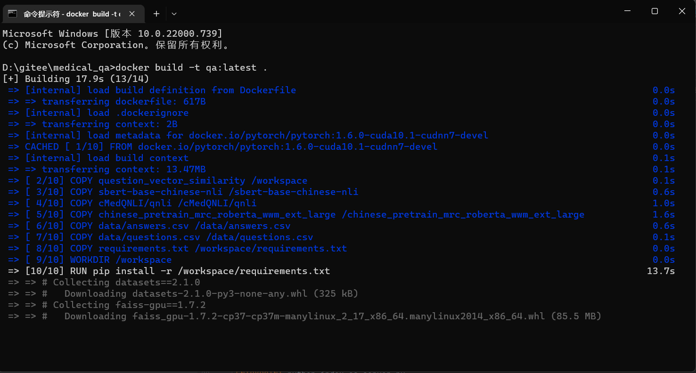
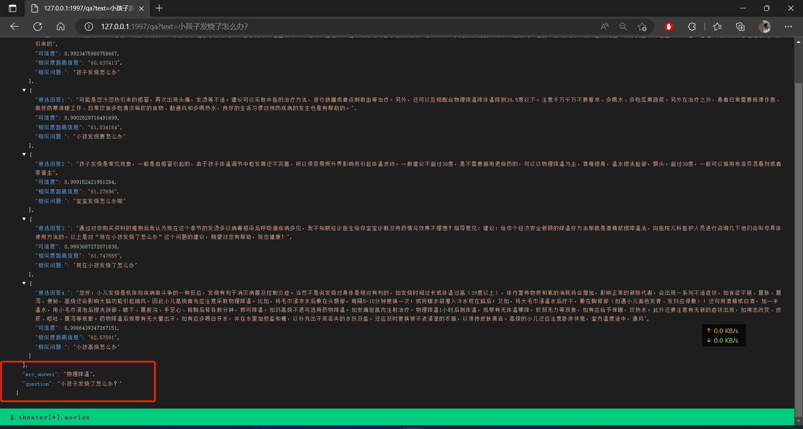

# medical_qa

A project about medical question and answering

# 近期论文阅读

近期阅读的部分论文和心得：

DrQA：[Reading Wikipedia to Answer Open-Domain Questions](https://arxiv.org/abs/1704.00051)

ORQA：[Latent Retrieval for Weakly Supervised Open Domain Question Answering](https://arxiv.org/abs/1906.00300)

DPR：[Dense Passage Retrieval for Open-Domain Question Answering](https://arxiv.org/abs/2004.04906)

[Learning Dense Representations of Phrases at Scale](https://arxiv.org/abs/2012.12624)

GAR：[Generation-augmented retrieval for open-domain question answering](https://arxiv.org/abs/2009.08553)

RocketQA：[RocketQA An Optimized Training Approach to Dense Passage Retrieval for Open-Domain Question Answering](https://arxiv.org/abs/2010.08191)

大致梳理一下open-domain question and answering的时间线和发展关系

DrQA是比较早期的问答系统，采用的retriever和reader都是比较原始的方法，retriever主要是一些TF-IDF以及BM25这样的sparse
embedding；而reader部分当时主流的双向LSTM+attention注意力机制，以之为代表的是[BiDAF](https://arxiv.org/abs/1611.01603)

ORQA主要是针对早期的retriever都是基于sparse embedding，当出现关键词没有覆盖的情况时，就无法进行匹配，其设计了一个ICT反向完型填空任务，原本谷歌的BERT采用的是对句子进行挖空，填写[Mask]
而ORQA从段落中挖出一个句子的空，预测该句子和上下文、以及负采样其他上下文；将句子视作伪的question，形成一个无监督的大规模预训练；90%是不涉及原词，10%涉及到原词

DPR直接对前面两项工作进行重构，这种挖空出来的伪question上下游任务并不一致，提出基于现在已经较为成熟的pretrain model进行dual-encoder和in-batch negative

Learning Dense Representations of Phrases at Scale

    紧承DPR往后做的研究。既然可以用向量搜索的形式，为什么一定还需要reader（IR的累计错误+reader过于慢），是否可以直接搜索答案的向量。
    对于短语来说取的是spanbert中短语开始和结束位置的向量表示；对于问题来说，为了和短语同维度，选择两个bert取两个cls。
    
    数据增强+知识蒸馏：一般来说一个文档只标注了一个问题，想要学习出句子级别的表示不太够；抽取出全部的实体，然后实体+文档->经过一个T5 generative model，生成提问。
    反过来，用一个好的spanbert mrc模型，判断生成的question+文档->answer是否高可信，高可信的加入到训练当中。--老师教学生的方法，数据增强。
    
    pre-batch，记录下单卡最近几轮计算时的向量，作为负样本，然后将这些负样本一起放到loss里面的分母里去。--本质上还是增大负样本数量，理论上只有是负样本模拟真实场景应该是尽可能多。

    query-side fine-tune：固定下phrase encode部分，然后单独对query向量&查询出来的phrase top k，+-进行一遍fine-tune。--便于迁移领域，缩小预训练和使用的差异。
    最后这个东西构建起来以后，基本就像一个知识图谱了

整体这个Learning Dense Representations of Phrases at Scale的工作和后面RocketQA很像，甚至RocketQA的思想和这个基本一致。pre-batch vs
in-batch、cross-encoder的数据增强和知识蒸馏。

GAR主要是更加模拟人的思考过程；当一个人收到一个问题的时候，心里会先想起一些答案，以及关于答案的印象；如果是开卷情况，再按照自己的印象进行查找
q-->generate{answer、content、title},这些扩展出来的信息，能够自然地蕴含意图并涉及到的更多信息，然后再放到一个轻量的retriever上进行检索

RocketQA主要是基于DPR的工作在往下进行展开

通过分布式的多GPU，提出cross batch negative来优化in-batch negative，模拟真实场景中存在大量负样本选一个正样本的情况（和pre-batch，基本思想一样）

现在contrastive learning的范式，需要拉近正样本，拉远负样本，而数据集通过很随机的采样方式，会导致负样本是伪负样本；
目前的训练集相对于真实的场景，训练的数据还是不够；

针对正负样本的问题(正样本不足&负样本为假），用一个效率比较低，但是效果比较好的cross-encoder结构来当teacher，然后帮助dual-encoder student进行学习

# 生成式对话问答模型

基于[gpt2-chinese-cluecorpussmall](https://huggingface.co/uer/gpt2-chinese-cluecorpussmall)，将问答和对话建模成生成式问题

即question+answer，从左往右进行生成

### 训练方法和过程

模型不知道哪部分是问句，哪部分是回答

参考[LaMDA: Language Models for Dialog Applications](https://arxiv.org/pdf/2201.08239.pdf)的做法

此处建模成

`<QBOS>` question `<QEOS>` `<ABOS>` answer `<AEOS>`

后续也可以按照这些special token扩展多轮问答和对话的训练

训练样例数据：

    <QBOS>小儿肥胖超重该怎样医治？<QEOS><ABOS>孩子一旦患上肥胖症家长要先通过运动和饮食来改变孩子的情况，要让孩子做一些他这个年龄段能做的运动，如游泳，慢跑等，要给孩子多吃一些像苹果，猕猴桃，胡萝卜等食物，禁止孩子吃高热量，高脂肪的食物，像蛋糕，干果，曲奇饼干等，严格的控制孩子的饮食，不要让他暴饮暴食，多运动对改变孩子肥胖都是有好处的，在治疗小儿肥胖期间如果情况严重，建议家长先带孩子去医院检查一下孩子肥胖症的原因在针对性的治疗。<AEOS>
    <QBOS>小儿肥胖能吃该如何治疗？<QEOS><ABOS>当孩子患上肥胖症的时候家长可以增加孩子的运动量和控制他的饮食来改变症状，像游泳，爬坡这类游泳运动对肥胖的症状都很好的效果，像冬瓜，西红柿这样高纤维的蔬菜要多吃一些，孩子不可以吃像蛋糕，夏威夷果这些高热量的食物，而且不要让孩子总是吃完就躺在床上不动，家长在治疗小儿肥胖期间如果孩子情况严重就要及时去医院在医生的指导下给孩子治疗。<AEOS>
    <QBOS>小儿肥胖超重该如何治疗？<QEOS><ABOS>孩子出现肥胖症的情况。家长要通过孩子运功和健康的饮食来缓解他的症状，可以先让他做一些有氧运动，比如慢跑，爬坡，游泳等，并且饮食上孩子多吃黄瓜，胡萝卜，菠菜等，禁止孩子吃一些油炸食品和干果类食物，这些都是干热量高脂肪的食物，而且不要让孩子总是吃完就躺在床上不动，家长在治疗小儿肥胖期间如果孩子情况严重就要及时去医院在医生的指导下给孩子治疗。<AEOS>
    <QBOS>小儿肥胖能吃该如何医治？<QEOS><ABOS>当孩子患上肥胖症的时候家长可以增加孩子的运动量和控制他的饮食来改变症状，家长要监督孩子做一些有氧运动像慢跑，游泳等，要给孩子多吃一些像苹果，猕猴桃，胡萝卜等食物，一定要禁止孩子吃蛋糕，板栗这些高热量的食物，生活中不要让孩子在床上吃零食或者吃完就躺着这些不好的习惯也会让脂肪堆积，肥胖症治疗期间家长要根据孩子的情况进行合理的治疗，如果病情严重的话一定要去医院查明原因针对治疗。<AEOS>

tokenizer-ID映射关系

    <QBOS>-1
    <QEOS>-2
    <ABOS>-3
    <AEOS>-4

tokenizer实例

    '<QBOS>癫痫病人请假吗？<QEOS><ABOS>病情分析：你好！你这个可以去医院看看指导意见：可以做一些检查，如果是癫痫，医生应该会给你开的。，癫痫病患者在及时治疗之外，患者在生活中还需要注意要保持良好的心情，好的心情对疾病的恢复很有帮助，希望上述的答案可以帮助到你，谢谢！<AEOS>'
    [101, 1, 4626, 4587, 4567, 782, 6435, 969, 1408, 8043, 2, 3, 4567, 2658, 1146, 3358, 8038, 872, 1962, 8013, 872, 6821, 702, 1377, 809, 1343, 1278, 7368, 4692, 4692, 2900, 2193, 2692, 6224, 8038, 1377, 809, 976, 671, 763, 3466, 3389, 8024, 1963, 3362, 3221, 4626, 4587, 8024, 1278, 4495, 2418, 6421, 833, 5314, 872, 2458, 4638, 511, 8024, 4626, 4587, 4567, 2642, 5442, 1762, 1350, 3198, 3780, 4545, 722, 1912, 8024, 2642, 5442, 1762, 4495, 3833, 704, 6820, 7444, 6206, 3800, 2692, 6206, 924, 2898, 5679, 1962, 4638, 2552, 2658, 8024, 1962, 4638, 2552, 2658, 2190, 4565, 4567, 4638, 2612, 1908, 2523, 3300, 2376, 1221, 8024, 2361, 3307, 677, 6835, 4638, 5031, 3428, 1377, 809, 2376, 1221, 1168, 872, 8024, 6468, 6468, 8013, 4, 102]
    ['<QBOS>', '癫', '痫', '病', '人', '请', '假', '吗', '？', '<QEOS>', '<ABOS>', '病', '情', '分', '析', '：', '你', '好', '！', '你', '这', '个', '可', '以', '去', '医', '院', '看', '看', '指', '导', '意', '见', '：', '可', '以', '做', '一', '些', '检', '查', '，', '如', '果', '是', '癫', '痫', '，', '医', '生', '应', '该', '会', '给', '你', '开', '的', '。', '，', '癫', '痫', '病', '患', '者', '在', '及', '时', '治', '疗', '之', '外', '，', '患', '者', '在', '生', '活', '中', '还', '需', '要', '注', '意', '要', '保', '持', '良', '好', '的', '心', '情', '，', '好', '的', '心', '情', '对', '疾', '病', '的', '恢', '复', '很', '有', '帮', '助', '，', '希', '望', '上', '述', '的', '答', '案', '可', '以', '帮', '助', '到', '你', '，', '谢', '谢', '！', '<AEOS>']

### 训练参数的脚本

    python run_clm.py \
      --model_name_or_path gpt2-chinese-cluecorpussmall \
      --train_file all.txt \
      --per_device_train_batch_size 6 \
      --do_train \
      --save_step=5000 \
      --num_train_epochs 4 \
      --output_dir ./medical-clm

训练用时`21小时12分钟`，4块GPU同时使用

### 训练好模型以后进行推理：

GPT-output1

这个结果还比较正常

GPT-output2

这个结果候选回答1不符合主题

GPT-output3

这个问题在文本训练的过程中没有涉及相关领域的训练数据，导致回答不好

为了保证相关性，可以对问句中的`疾病`、`症状`建立术语表后进行分词，回答中至少出现相关疾病、症状才算相关的回答。

（这个扩展一下，类似于[BM25](https://link.springer.com/chapter/10.1007/978-3-030-32686-9_5)
算一下query和document的相关性，仍然是基于`sparse vector`进行相似度度量）

（后面实现了一种基于`cross-encoder`模式的[qnli](https://arxiv.org/pdf/1804.07461v3.pdf)模型用于检查query和answer之间的成立关系，效果较好，推理时间也不错）

### 存在一些问题：

    1.知识修改的代价--疾病治疗情况发生了改变
    2.逻辑修改的代价--新的疾病进来
    3.模型本身输出的不可控性--模型答非所问，任意提问也是会有回答的，原本基于的gpt2-chinese-cluecorpussmall也存在一些知识，存在输出toxic words的风险
    4.推理速度比较慢--本身语言模型的问题

问题1和2的共性：

需要重新训练，或者基于现有的模型continuously train，并且内部feed forward中存储的kv（知识），并不知道在增量式训练下，应该训练到什么程度足够，又或者会不会影响之前的知识

idea from [Transformer Feed-Forward Layers Are Key-Value Memories](https://arxiv.org/abs/2012.14913)

transformer的本质还是在feed forward层建立起来了kv，而kv代表的就是知识

那么整个问答的对话过程就可以按照检索KV的形式进行推进

### 基于faiss做question的语义向量空间搜索

[faiss学习](FAQ_vector_similarity/README.md)

将原csv文件中的question，经过sbert-base-chinese-nli，encode成向量，然后将向量送入到faiss当中进行索引构建

每当新进来一个question的时候，将这个question也encode成向量，然后基于faiss进行向量检索

选择最相似的question的答案来作为目标question的答案

项目流程图

#### 构建过程

首先将所有的question去重以后，经过`bert`变成`1*768`
维的向量，选取的bert模型为[sbert-base-chinese-nli](https://huggingface.co/uer/sbert-base-chinese-nli)

将向量送入到faiss的IndexIVFPQ方法进行索引构建

这个方法的好处是

其一是进行聚类，避免了在搜索的过程中进行全部向量的暴力搜索和比较

其二是进行了乘积向量变换，对向量进行了压缩，避免了之后可能扩展系统768维向量都加载到内存中造成cuda溢出

参数情况： `256-聚类中心` `划分8个子空间` `256-子空间聚类中心-8bits`

1.索引构建时间和加载answer所用时间.png

2.单条查询所需时间

整体比GPT-2要快很多

vs GPT-2生成单个问题5条回答所用的时间

大致时间差8~9倍

3.查询质量

Faiss-output1

Faiss-output2

Faiss-output3

Faiss-output4

相比于GPT-2，输出都是严格按照预定义好的格式，不会不可控

对于未定义的问题，由于问句太短，相似度比较容易相似，例如牙齿托槽掉了应该如何治疗和宝宝发热了应该如何治疗都是比较相似的

如果预定义的问题里面没有牙齿、托槽相关的question，就会导致发烧也可能会被匹配出来，而且相似度较高

经过一定的试验和观察，distance如果大于150的话，检索出来的结果基本不太可信

将其设置为unanswerable，或者提示提问不明显。

faiss-unanswerable1

query->question->answer

其实本质上和搜索没有什么区别，把query看作是一条查询

question相当于是各个`文章/新闻/网页`的`标题`

基于标题进行内容检索的过程

#### 缺点分析

回答只能限定在原本的这些问题-答案里面，扩展的时候就得加问题-答案；并且随之修改索引（倒排索引，faiss索引）等。

相似度算法选择：tf-idf/BM25算法/编辑距离相似度/基本的词向量距离，基于深度学习/s-bert做语义相似

前者主要是关键词匹配，语义信息不需要两者完全一致，模糊场景，构建索引比较高效和快速；后者基于深度语义信息，构建索引较慢

为了便于知识库的扩展，考虑采用dual-encoder的形式，由query直接对answer进行索引。

### 构建answer的向量表示

基于传统的搜索算法：

BM25

首先将所有answer去重后进行jieba分词，过滤掉部分停用词，保存到answer_cut.csv

基于此再构建一个词的倒排索引，包含某个词的文档有哪些，记录下其id

阅读DPR的论文-[Dense Passage Retrieval for Open-Domain Question Answering](https://arxiv.org/abs/2004.04906)

    For example, synonyms or paraphrases that consist of
    completely different tokens may still be mapped to
    vectors close to each other. Consider the question
    “Who is the bad guy in lord of the rings?”, which can
    be answered from the context “Sala Baker is best
    known for portraying the villain Sauron in the Lord
    of the Rings trilogy.

包含完全不相同的词的两段文本（Q，A）也是具有对应关系的；

这种时候如果用稀疏的BM25就可能算出来score值比较低，导致文本被筛选掉；而在医疗问答当中尤其明显，大部分的回答并不是直接大量cover query当中的原词

DPR的基本原理，dual-encoder

一般还是考虑query/question用一个encoder，answer/reference text部分用另一个encoder

训练完成后，同样采用faiss进行索引构建

### 训练一个QNLI模型，用于判断当前找到的answer是否成立

由于找最相似的question/answer 都不可避免出现答非所问的情况，考虑`cross-encoder`结构的`QNLI`任务

[训练集](cMedQNLI/data/QNLI_train_file.json)

[验证集](cMedQNLI/data/QNLI_eval_file.json)

训练参数：

    python run_glue.py \
      --model_name_or_path ../pretrain_model/bert-base-multilingual-cased \
      --train_file ./data/QNLI_train_file.json  \
      --validation_file ./data/QNLI_eval_file.json \
      --do_train \
      --do_eval \
      --max_seq_length 512 \
      --per_device_train_batch_size 6 \
      --learning_rate 3e-5 \
      --num_train_epochs 3 \
      --output_dir ./qnli \

训练时长共计：1小时16分钟

训练完成后可以用于精排阶段，验证文本是否是答案，甚至可以选择输出label为entailment且score值最高的answer来作为答案。

测试一些基本的对话

test_qnli1

test_qnli2

test_qnli3

test_qnli4

关于cross-encoder为什么要比dual-encoder更适合做精排的一些想法：

    dual-encoder是两边分别只看到单独的文本，各自算出一个向量表示，好处是这些向量可以预先算出来存储
    时间复杂度是O(m+n)
    
    cross-encoder是两个句子逐字逐句一个一个进行attention比较，更加精确
    如果要全部文档扫一遍的话，时间复杂度为O(n*m)

之前的方法利用相似度距离信息进行粗略地筛选

当distance小于150时进行answer输出，但是这个实际上是不合理的，相似度低说明几乎接近question库里的问题，

而有一些能够对应上的question相似度确是190多，表意一致，但是相似度较大

同时，原本qa对也可能出现答非所问的情况，相似度高并不一定就是好的回答

由于qnli任务选用小bert模型，inference的时候耗时较少，考虑由qnli推断找到的answer是否要进行输出:

输出情况：

faiss-output_with_qnli1

faiss-output_with_qnli2

### 把整个项目打包成api+docker

服务启动

服务访问

docker打包

服务访问（user）

